# Phase 1: New Database — Sourcing, Schema & Baseline

## 1. Sourced a real climate dataset

I sourced a real, science-backed dataset instead of reusing `healthcare_dba` from Project 1, since the whole point of this project is to start with a fresh, intentionally unoptimized "before" state I can diagnose and fix in later phases. I chose NOAA's Global Historical Climatology Network Daily (`GHCN-Daily`) — the same dataset used in peer-reviewed climate research, distributed under a CC0 public domain license.

I downloaded three years of daily observation data (`2021.csv`, `2022.csv`, `2023.csv`, ~3.8GB combined) plus the station metadata file (`ghcnd-stations.txt`, ~10.9MB) directly from NOAA's public S3 bucket.

I hit one real snag here: my first attempt at the yearly CSV URL (`csv/2023.csv`) returned a `NoSuchKey` error. NOAA had restructured their bucket prefixes, and the correct path needed an extra `by_year/` segment (`csv/by_year/2023.csv`). I documented this rather than quietly routing around it, since it's exactly the kind of real-world gotcha worth keeping visible.

## 2. Moved the raw data into the VM

Since `SQLDBA-Primary` is a separate Hyper-V VM, I needed a way to get these files onto it. I enabled Hyper-V's Guest Services integration service, which let me copy files directly between my host and the VM console — no shared network folder needed for this one-time transfer. I moved all four files into `C:\ClimateData\` inside the VM.

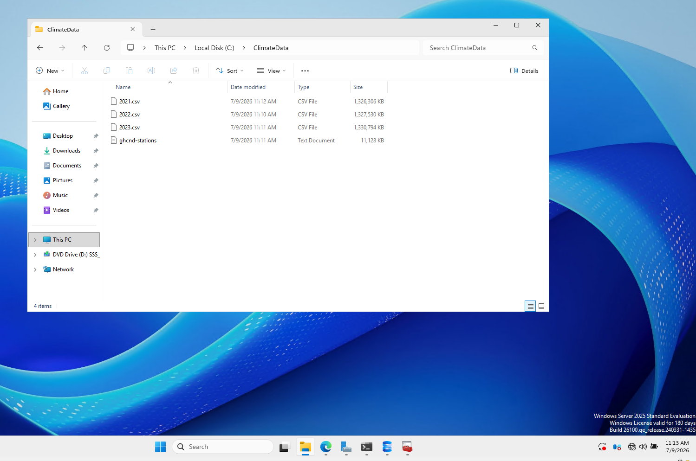

## 3. Created the new database

I created a new database, `climate_dba`, alongside the existing `healthcare_dba`, deliberately kept separate rather than replacing it.

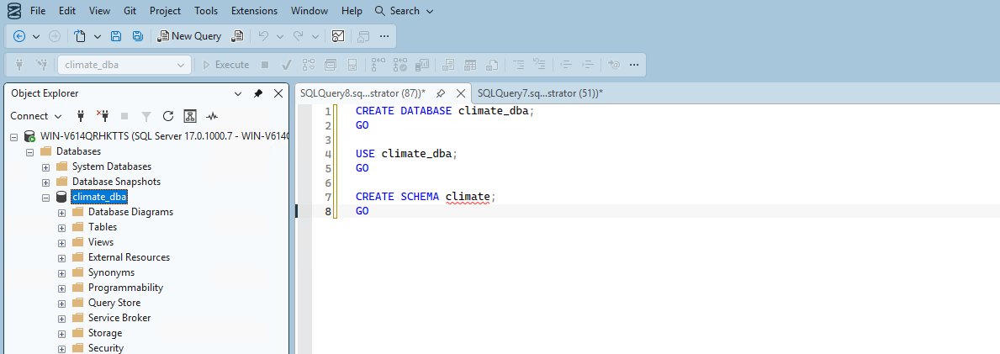

## 4. Designed the schema — deliberately unoptimized

I created a dedicated `climate` schema containing two tables:

- **`climate.stations`** — station_id, latitude, longitude, elevation, state, station_name (all `VARCHAR`, no keys or indexes)
- **`climate.daily_observations`** — station_id, obs_date, element, data_value, m_flag, q_flag, s_flag, obs_time (all `VARCHAR`, no keys or indexes)

This is deliberately naive: no primary keys, no foreign key relationship between the two tables, no indexes on the columns I'd obviously query on (`station_id`, `obs_date`), and dates/numbers stored as text instead of proper types. This matches how a rushed first pass at this data would actually look, and gives me a real "before" state to improve in Phase 4.

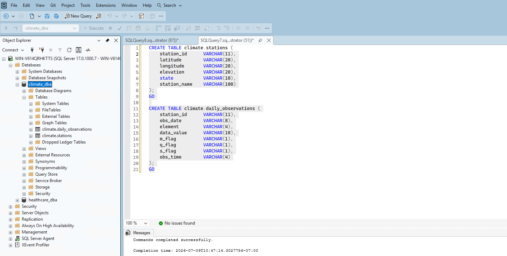

## 5. Loaded the station metadata

`ghcnd-stations.txt` is a fixed-width file, so I loaded it into a staging table (`climate.stations_staging`) as raw text lines first, then parsed it into `climate.stations` using `SUBSTRING` based on the documented column positions.

Getting `BULK INSERT` to actually read the file correctly took two failed attempts. I initially assumed the file used a standard Windows `\r\n` line ending and specified `ROWTERMINATOR = '\r\n'`, which failed. Checking the raw bytes showed the file actually uses bare Unix-style line feeds (`0x0A`). The real fix, though, was realizing T-SQL doesn't interpret `'\n'` as an escape sequence — it reads it as two literal characters (backslash and "n"), not a newline. Using the hex literal `ROWTERMINATOR = '0x0a'` fixed it immediately.

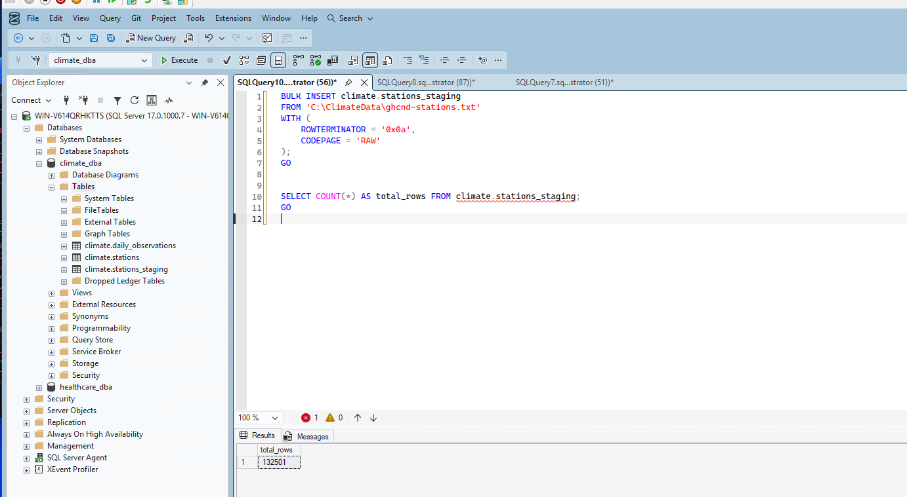

After parsing into the real table, I confirmed 132,501 rows with realistic, correctly-split data.

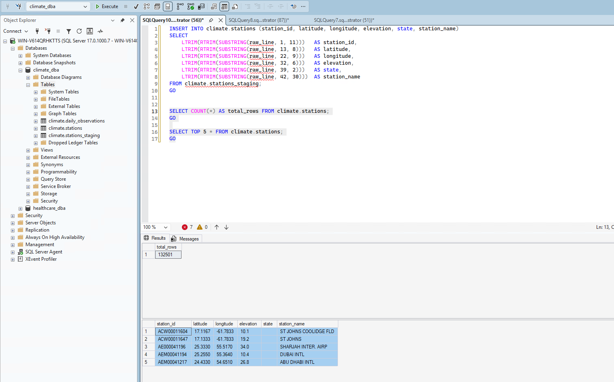

## 6. Bulk-loaded three years of observations

Loading the three yearly observation CSVs was more straightforward once I knew about the line-ending issue — same `0x0a` row terminator, comma field terminator, and `FIRSTROW = 2` to skip a header row I discovered these files actually have.

2023 alone loaded 37,907,983 rows:

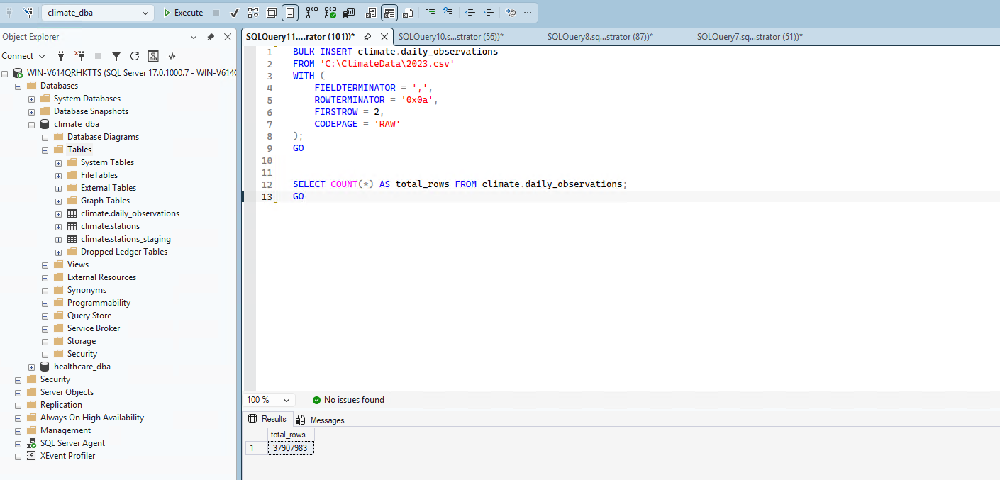

All three years combined loaded 113,522,932 rows total:

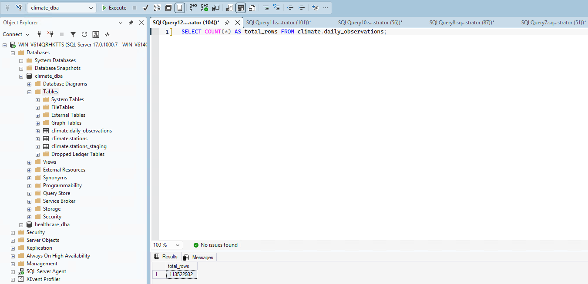

## 7. Ran baseline diagnostics on the unindexed schema

With the data loaded, I ran two realistic queries against the schema as-is to establish a documented "before" state.

**Query 1 — filter by station_id:**
```sql
SELECT * FROM climate.daily_observations WHERE station_id = 'USW00094728';
```
- 19,183 rows returned
- 758,511 logical reads, scan count 9 (parallel table scan)
- 1.658 seconds elapsed
- SQL Server's own missing-index recommendation: nonclustered index on `station_id`, estimated 99.5% impact

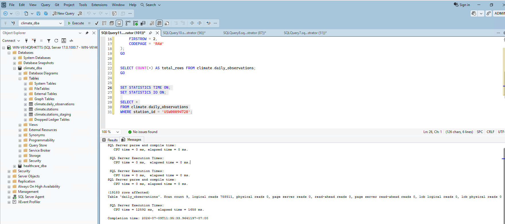

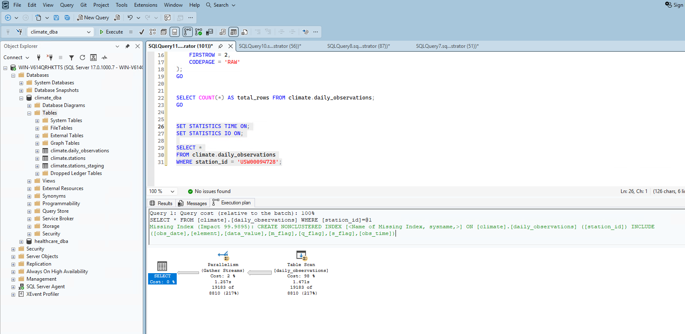

**Query 2 — filter by date range:**
```sql
SELECT * FROM climate.daily_observations WHERE obs_date BETWEEN '20230701' AND '20230731';
```
- 3,217,200 rows returned
- 758,511 logical reads, scan count 9 — identical I/O cost to Query 1, since both force a full scan of the same table regardless of which column is filtered
- 17.371 seconds elapsed — notably slower than Query 1, which I attribute to the much larger result set being returned to the client rather than a difference in scan cost
- SQL Server's missing-index recommendation here: nonclustered index on `obs_date`, estimated 68.3% impact

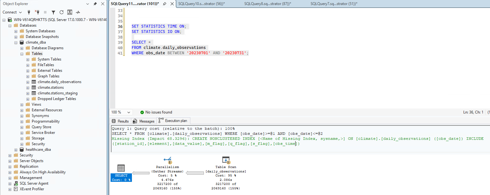

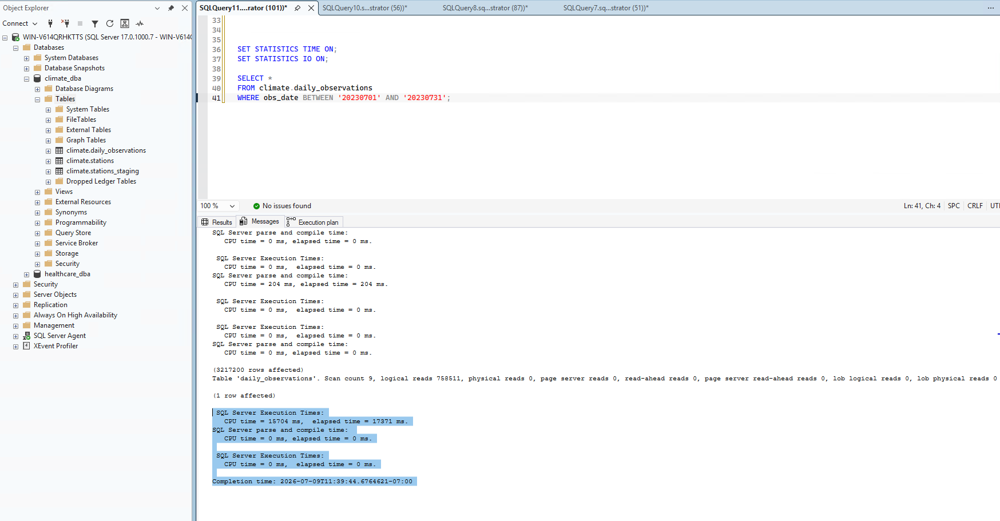

Both execution plans confirm a full **Table Scan** with **Parallelism**, and both show SQL Server's row estimates were significantly off from actual row counts (155–217%) — a direct consequence of having no statistics maintenance or proper indexing on this table yet.

## What's Next

This gives me two real, reproducible baseline numbers — and two competing missing-index recommendations (one on `station_id`, one on `obs_date`) — that I'll come back to in Phase 4 to design a real indexing strategy and measure genuine improvement, rather than just applying whatever SQL Server suggests without thinking it through.
