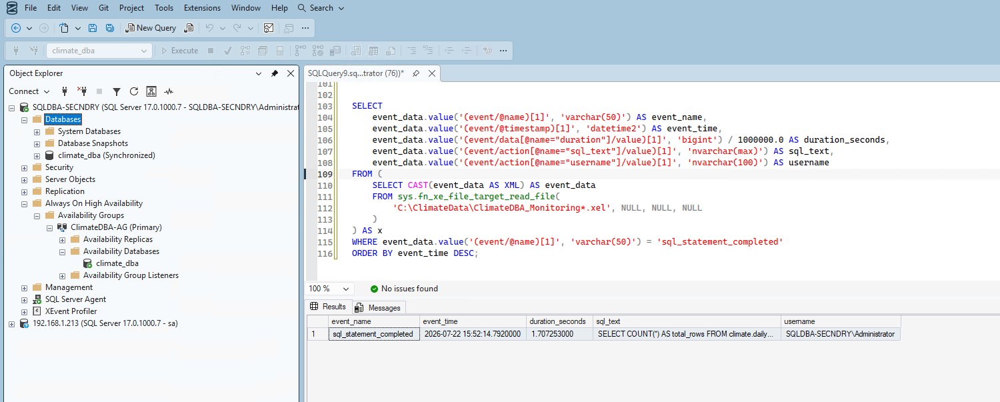
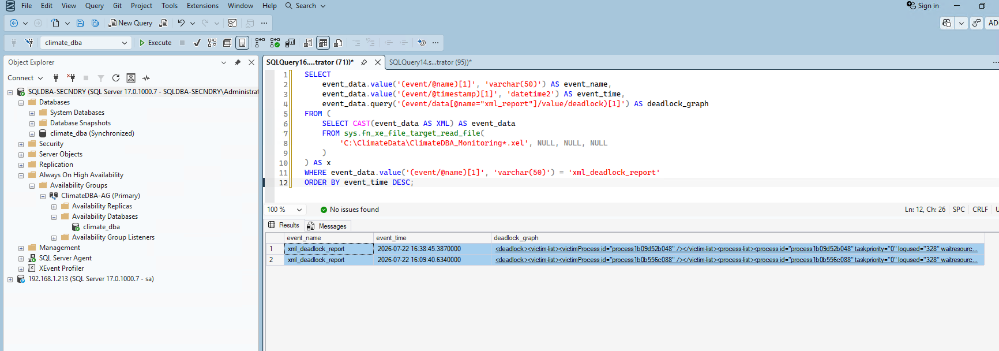

# Phase 10: Monitoring

With Always On, backups, security, and automation all working from Phase 9, what I didn't have yet was any real visibility into what the server was actually doing minute to minute. If a query started running slow or two transactions deadlocked each other, I'd have no way of knowing unless I happened to be watching. Phase 10 was about closing that gap: a DMV-based query set for session/query/resource monitoring, and an Extended Events session that catches deadlocks and long-running queries as they happen.

I connected to `192.168.1.214` (`SQLDBA-SECNDRY`), which has been the AG primary since the Phase 9 failover test, and did everything against `climate_dba` from there.

## 1. Session-level monitoring — who's connected and how expensive

I started with the simplest layer: what's actually connected right now, and how much work each session has done.

```sql
SELECT
    session_id, login_name, host_name, program_name, status,
    cpu_time, memory_usage, reads, writes, logical_reads,
    last_request_start_time, last_request_end_time
FROM sys.dm_exec_sessions
WHERE is_user_process = 1
ORDER BY cpu_time DESC;
```

The output was unremarkable in a good way — my own SSMS sessions, plus SQL Server Agent's job invocation engine showing activity at 08:40:00, which lines up exactly with the `Climate_DBA_Log_Backup` job's 5-minute schedule from Phase 8. A small but useful confirmation that the automation is still ticking along in the background exactly as configured.

## 2. Query-level monitoring — what's actually expensive

Next I wanted to know which cached queries had done the most damage since the instance last started:

```sql
SELECT TOP 10
    qs.execution_count,
    qs.total_worker_time / 1000 AS total_cpu_ms,
    qs.total_worker_time / qs.execution_count / 1000 AS avg_cpu_ms,
    qs.total_logical_reads,
    qs.total_logical_reads / qs.execution_count AS avg_logical_reads,
    qs.total_elapsed_time / 1000 AS total_elapsed_ms,
    qs.last_execution_time,
    SUBSTRING(st.text, (qs.statement_start_offset/2) + 1,
        ((CASE qs.statement_end_offset WHEN -1 THEN DATALENGTH(st.text)
            ELSE qs.statement_end_offset END - qs.statement_start_offset)/2) + 1) AS query_text
FROM sys.dm_exec_query_stats qs
CROSS APPLY sys.dm_exec_sql_text(qs.sql_handle) st
ORDER BY qs.total_worker_time DESC;
```

The heaviest query by a wide margin was one I recognized immediately:

```
SELECT COUNT(*) AS total_rows FROM climate.daily_observations
```

2 executions, ~7,413ms average CPU, ~861,329 average logical reads. I wasn't surprised — I documented back in Phase 4 that `climate.daily_observations` has a composite clustered index on `(station_id, obs_date)`, so a query with no `WHERE` clause at all can't seek on anything and has to fully scan all 113,522,932 rows. That's not a bug, it's just the cost of a total count with no predicate on a table this size. Everything else in the top 10 was SSMS's own Object Explorer and IntelliSense background queries, which was a useful sanity check that this DMV cleanly separates real workload from tooling noise.

## 3. Resource-level monitoring — wait stats

The third lens was `sys.dm_os_wait_stats`, filtered down to strip out the usual idle/background wait types:

```sql
SELECT TOP 15 wait_type, waiting_tasks_count, wait_time_ms, max_wait_time_ms,
    signal_wait_time_ms, wait_time_ms - signal_wait_time_ms AS resource_wait_time_ms
FROM sys.dm_os_wait_stats
WHERE wait_type NOT IN (/* ~25 benign/idle wait types excluded */)
ORDER BY wait_time_ms DESC;
```

This surfaced something genuinely worth documenting: `HADR_SYNC_COMMIT` topped the list at 5,343,394ms across 26,478 waits, alongside `HADR_WORK_QUEUE`, `HADR_TIMER_TASK`, and `HADR_NOTIFICATION_DEQUEUE`. This is the real, measurable cost of running Always On AG with synchronous commit — every commit on the primary has to wait for the secondary to harden the log record before it can complete. It's not free, and now I have actual numbers proving it, tying directly back to the AG I built in Phase 9. `VDI_CLIENT_OTHER` lined up with the constant 5-minute log backup job (backups use the VDI API), and the `QDS_*` waits were just Query Store's own background housekeeping.

## 4. Building the Extended Events session

DMV snapshots only show what's happened cumulatively or what's happening right now — they won't reliably catch a one-off deadlock or a single slow query after it's already finished. For that I built an Extended Events session covering both cases the phase called for:

```sql
CREATE EVENT SESSION [ClimateDBA_Monitoring] ON SERVER
ADD EVENT sqlserver.xml_deadlock_report,
ADD EVENT sqlserver.sql_statement_completed(
    ACTION(sqlserver.sql_text, sqlserver.session_id, sqlserver.username, sqlserver.database_name)
    WHERE ([sqlserver].[database_name] = N'climate_dba' AND duration > 1000000)
)
ADD TARGET package0.event_file(
    SET filename = N'C:\ClimateData\ClimateDBA_Monitoring.xel',
    max_file_size = 50, max_rollover_files = 5
)
WITH (MAX_MEMORY = 4096 KB, EVENT_RETENTION_MODE = ALLOW_SINGLE_EVENT_LOSS, MAX_DISPATCH_LATENCY = 5 SECONDS);

ALTER EVENT SESSION [ClimateDBA_Monitoring] ON SERVER STATE = START;
```

I set the long-running-query threshold at 1 second (`duration > 1000000` microseconds), scoped to `climate_dba` only so I wasn't picking up noise from other databases on the instance. I verified it came up correctly, active and writing to `C:\ClimateData\ClimateDBA_Monitoring_0_134292088095250000.xel`.

## 5. Real problem: my first capture attempt came back empty

I wanted to prove this actually works rather than just assume it does. I re-ran the same `COUNT(*)` full-scan query I'd already seen take over 7 seconds, expecting it to trip the 1-second threshold again, then queried the `.xel` file for `sql_statement_completed` events.

Nothing came back. Zero rows.

Before assuming the session itself was broken, I checked the query's actual last-execution timing instead of the cumulative average:

```sql
SELECT qs.execution_count, qs.last_elapsed_time / 1000.0 AS last_elapsed_ms,
    qs.last_worker_time / 1000.0 AS last_cpu_ms, qs.last_execution_time, st.text
FROM sys.dm_exec_query_stats qs
CROSS APPLY sys.dm_exec_sql_text(qs.sql_handle) st
WHERE st.text LIKE '%daily_observations%' AND st.text LIKE '%COUNT%';
```

That's when it made sense: the standalone re-run had completed in **748.57ms** — under my 1-second threshold. The original run took 5.9–7.4 seconds because it had to physically read all 113.5M rows' worth of pages off disk. By the time I ran it again, the buffer pool had those same pages cached in memory, so the identical scan finished about 10x faster. The XE session wasn't broken — I'd just inadvertently warmed the cache with my own testing, so I no longer had a genuinely slow query to catch.

To get an honest test, I forced a real cold cache with `DBCC DROPCLEANBUFFERS` — a standard technique for reproducing cold-cache behavior, something I'd only ever run in this lab, never against a production system:

```sql
DBCC DROPCLEANBUFFERS;
SELECT COUNT(*) AS total_rows FROM climate.daily_observations;
```

Re-reading the file target this time gave me a real captured row: event time `2026-07-22 15:52:14.792`, duration `1.707253` seconds, correct query text, correct login. The monitoring works.



## 6. Proving deadlock capture with a real deadlock

The session also had `xml_deadlock_report` wired up, and I didn't want to leave that half unverified. I set up two small test tables and opened a second SSMS window:

```sql
CREATE TABLE dbo.deadlock_test_a (id INT PRIMARY KEY, val INT);
CREATE TABLE dbo.deadlock_test_b (id INT PRIMARY KEY, val INT);
INSERT INTO dbo.deadlock_test_a VALUES (1, 100);
INSERT INTO dbo.deadlock_test_b VALUES (1, 200);
```

In the second window, I opened a transaction and locked table A, deliberately left uncommitted:

```sql
BEGIN TRAN;
UPDATE dbo.deadlock_test_a SET val = 999 WHERE id = 1;
```

Back in my first window, I opened a transaction that locked table B, then tried to lock table A — which blocked immediately, since the second window already held that lock:

```sql
BEGIN TRAN;
UPDATE dbo.deadlock_test_b SET val = 888 WHERE id = 1;
UPDATE dbo.deadlock_test_a SET val = 777 WHERE id = 1;  -- hangs
```

Then, in the second window, I closed the cycle by trying to lock table B, which the first window now held:

```sql
UPDATE dbo.deadlock_test_b SET val = 111 WHERE id = 1;
```

Within a couple of seconds, SQL Server's deadlock monitor caught the circular wait and killed one side of it automatically:

```
Msg 1205, Level 13, State 51, Line 14
Transaction (Process ID 95) was deadlocked on lock resources with another process
and has been chosen as the deadlock victim. Rerun the transaction.
```

The other window's blocked `UPDATE` then completed normally as soon as the lock released. Pulling the deadlock graph out of the `.xel` file confirmed everything I'd expect from a textbook deadlock: SPID 95 was the victim, waiting on the lock for `deadlock_test_b`, while SPID 112 held that lock and was itself waiting on `deadlock_test_a` — held by SPID 95. A clean circular wait, captured exactly as it happened.

I actually ran this test twice — the first time to confirm the capture worked at all (victim SPID 72 that time), and a second time to get a clean screenshot. The results grid below shows both events captured independently, which is itself good evidence: the session isn't a one-off fluke, it reliably catches every deadlock, not just the first one.



I committed the surviving transaction and dropped both test tables once I was done.

## Honest limitation carried forward

This monitoring is entirely pull-based. Nothing here pushes an alert by email, because Database Mail was never configured in this lab (no real SMTP server available in this workgroup environment, documented back in Phase 8). Catching a deadlock or a slow query still means someone runs these queries or reads the `.xel` file. That's a real constraint of this environment, not something I'm papering over.

## Summary

| Item | Status | Real issue encountered |
|---|---|---|
| Session-level monitoring | ✅ Complete | None |
| Query-level monitoring | ✅ Complete | None — confirmed known full-scan behavior from Phase 4 |
| Wait-stats monitoring | ✅ Complete | None — surfaced real AG synchronous-commit overhead |
| Extended Events session (deadlocks + long queries) | ✅ Complete | None |
| Long-running query capture | ✅ Verified with real event | First attempt returned zero rows — buffer cache had warmed up between runs, dropping the query under threshold; resolved by forcing a cold cache with `DBCC DROPCLEANBUFFERS` |
| Deadlock capture | ✅ Verified with real event (twice) | None |

## What's Next

With monitoring in place and proven against real events, only **Phase 11 — Documentation & Portfolio Packaging** remains, pulling all ten phases together into the finished portfolio site.
