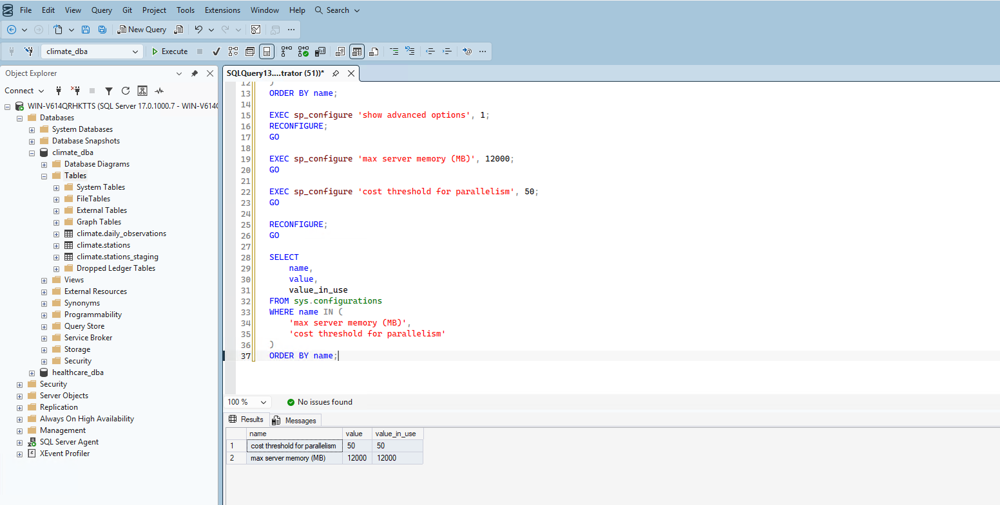
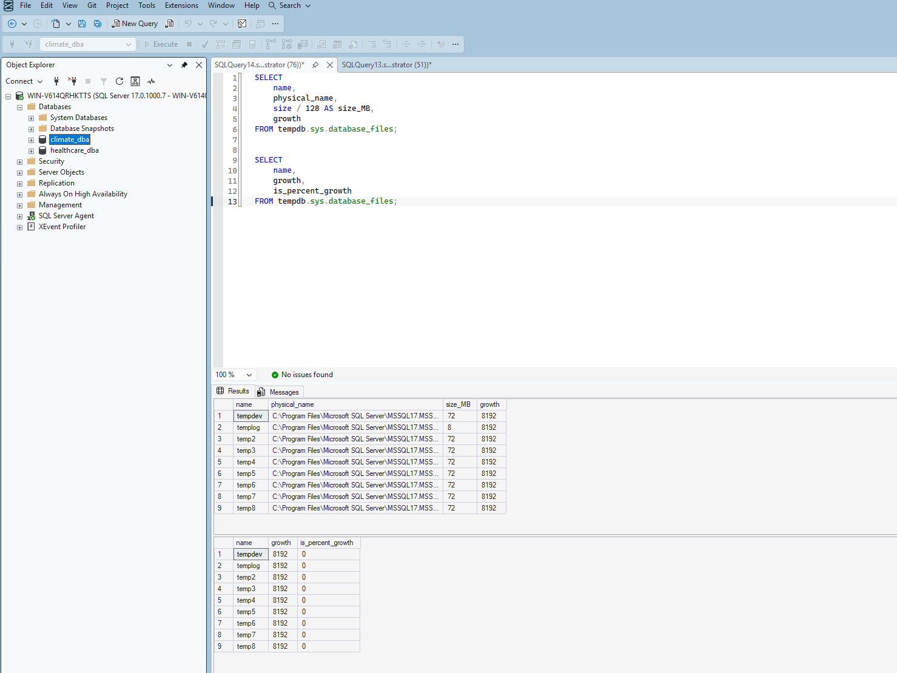
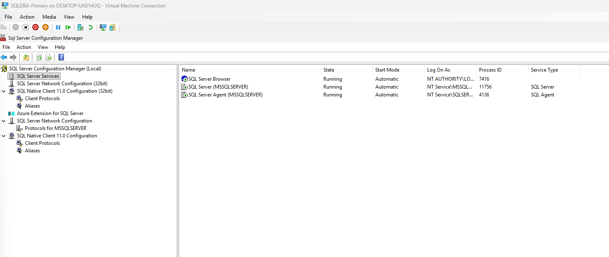

# Phase 2: Installation & Configuration

## 1. Verified and extended the existing install

Since SQL Server 2025 Enterprise Developer Edition was already installed on `SQLDBA-Primary` during Project 1, this phase wasn't a reinstall — it was an audit of the server-level configuration against best practices, fixing what genuinely needed fixing and confirming what was already correct.

## 2. Audited memory, MAXDOP, and cost threshold for parallelism

I started by pulling the current values for the four settings most worth reviewing early:

```sql
SELECT name, value, value_in_use, description
FROM sys.configurations
WHERE name IN (
    'max server memory (MB)',
    'min server memory (MB)',
    'max degree of parallelism',
    'cost threshold for parallelism'
)
ORDER BY name;
```

**What I found:**

| Setting | Value | Assessment |
|---|---|---|
| `cost threshold for parallelism` | 5 | Factory default from decades ago — too low for modern hardware, causes small queries to parallelize unnecessarily |
| `max degree of parallelism` | 8 | Already correct — matches my 8 vCPUs exactly |
| `max server memory (MB)` | 2147483647 | SQL Server's "unlimited" default — on a 16GB VM, this risks starving the OS itself |
| `min server memory (MB)` | 0 | Negligible at these numbers, not worth changing |

## 3. Fixed memory cap and cost threshold

I capped `max server memory` at 12,000 MB — reasoning: 16GB total on the VM, leaving ~4GB headroom for the OS, page file, and other Windows processes (Agent, monitoring tools), leaves 12GB for SQL Server. This isn't an aggressive squeeze, just a standard safe starting point I can revisit in Phase 4 with real wait-stat evidence if it turns out to be too conservative.

I raised `cost threshold for parallelism` from 5 to 50, stopping small, cheap queries from being parallelized unnecessarily — a widely-used modern starting point rather than the decades-old default.

```sql
EXEC sp_configure 'show advanced options', 1;
RECONFIGURE;

EXEC sp_configure 'max server memory (MB)', 12000;
EXEC sp_configure 'cost threshold for parallelism', 50;

RECONFIGURE;
```

I verified both changes took effect immediately:



## 4. Verified TempDB configuration

I checked TempDB's file count, size, and growth settings against best practice — one data file per CPU core, equal sizing, a single log file, and fixed-MB rather than percentage-based autogrowth.

**Result: TempDB was already correctly configured from Project 1.** 8 equally-sized data files (72MB each) matching my 8 vCPUs, 1 log file, and fixed-MB autogrowth confirmed on every file (`is_percent_growth = 0` across the board). I didn't manufacture a fix here — this is a genuine "already correct, no changes needed" finding, which is exactly the kind of honest result I want to document rather than force busywork onto.



## 5. Verified authentication mode

I confirmed Mixed Mode authentication (both SQL logins and Windows auth) is still active, as deliberately configured in Project 1:

```sql
SELECT SERVERPROPERTY('IsIntegratedSecurityOnly') AS is_windows_auth_only;
```

Result: `0` — Mixed Mode confirmed, no change needed.

## 6. Verified core services are running

I checked SQL Server Configuration Manager to confirm the instance is healthy and that SQL Server Agent — which I'll need in Phase 8 for automation — is running.



SQL Server, SQL Server Agent, and SQL Server Browser were all confirmed **Running** with **Automatic** start mode.

## Summary

| Item | Before | After |
|---|---|---|
| max server memory (MB) | 2147483647 (unlimited) | 12000 |
| cost threshold for parallelism | 5 | 50 |
| max degree of parallelism | 8 | 8 (already correct) |
| TempDB files | 8 files, fixed-MB growth | Unchanged (already correct) |
| Authentication mode | Mixed Mode | Unchanged (already correct) |
| Core services | Running | Unchanged (already correct) |

## What's Next

With server-level configuration verified and corrected, Phase 3 moves into storage management — filegroups, capacity planning, and maintenance routines (statistics updates, index maintenance, integrity checks) for the `climate_dba` database.
