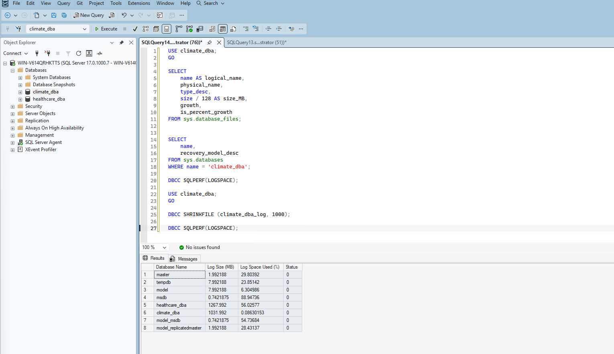
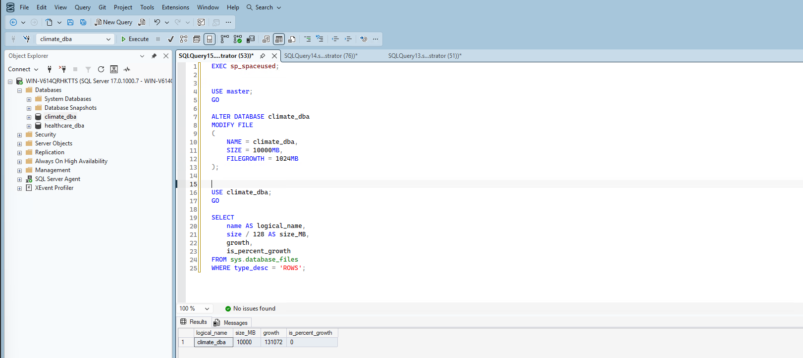
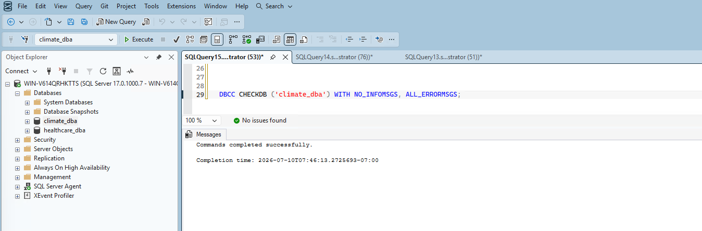
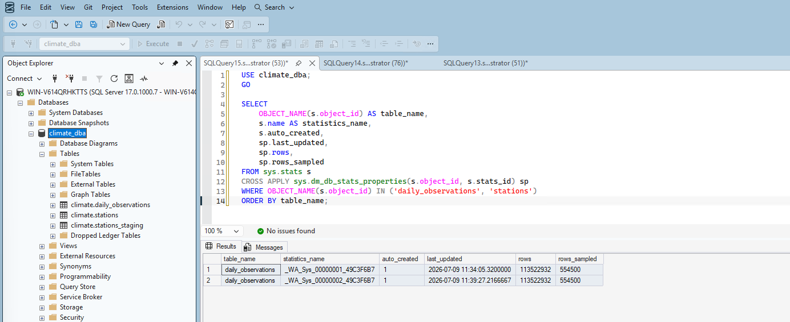
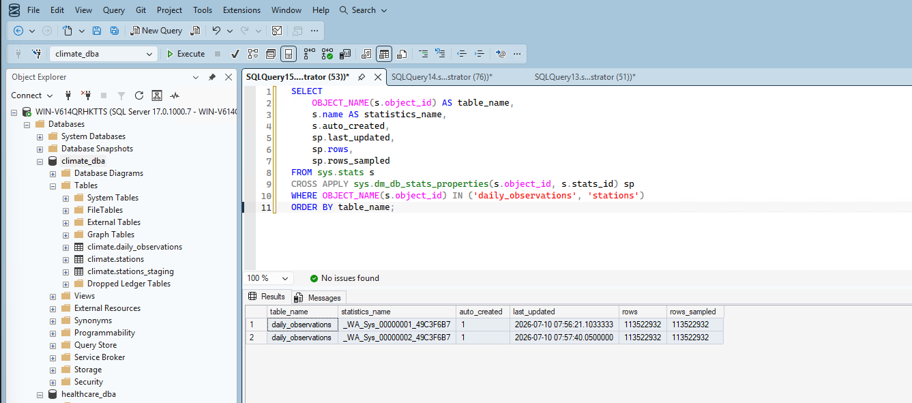

# Phase 3: Storage & Database Maintenance

## 1. Reviewed the current file layout

I started by checking `climate_dba`'s current filegroup and file layout:

```sql
SELECT name AS logical_name, physical_name, type_desc, size / 128 AS size_MB, growth, is_percent_growth
FROM sys.database_files;
```

This immediately surfaced something worth investigating: the **log file (13,064 MB) was larger than the data file (5,960 MB)** — an unusual ratio worth digging into rather than ignoring.

## 2. Investigated the oversized log file

I checked the recovery model and found `climate_dba` was created under **Full recovery** — SQL Server's default for new databases. That meant every single row from all four Phase 1 bulk loads (132,501 station rows + 113.5 million observation rows) was fully logged, transaction by transaction, rather than minimally logged.

I confirmed how much of that log was actually needed:

```sql
DBCC SQLPERF(LOGSPACE);
```

Result: the 13,064 MB log file was only **15.12% in use** — roughly 11.7GB of empty, reclaimable space.

**Decision:** I kept the Full recovery model intact, since Phase 5's point-in-time restore drill specifically needs it. But I shrank the log file as a one-time cleanup — a legitimate use case for `DBCC SHRINKFILE`, distinct from routinely shrinking logs as ongoing practice.

```sql
DBCC SHRINKFILE (climate_dba_log, 1000);
```

Verified before/after:



The log dropped from 13,064 MB to ~1,032 MB, reclaiming about 12GB of disk space.

## 3. Found the data file was nearly full

Checking overall space usage:

```sql
EXEC sp_spaceused;
```

Showed only **7.40 MB of unallocated space** remaining in a 5,960 MB data file — essentially full. Combined with a fixed 64MB growth increment (set back in Project 1), this meant frequent small autogrowth events were about to start happening — a real, classic problem: each growth event briefly pauses writes and contributes to file fragmentation over time.

## 4. Proactive capacity planning

I grew the data file ahead of time rather than letting autogrowth handle it reactively. My reasoning: current actual data is ~5,948MB with zero indexes yet. Phase 4 will add real indexes on `station_id` and `obs_date`, which typically adds 15–30% overhead on a table this wide — putting a near-term ceiling around 8,000–9,000 MB. I grew the file to **10,000 MB** for comfortable headroom, and raised the growth increment from 64MB to **1024MB (1GB)** so future growth events are far less frequent.

```sql
ALTER DATABASE climate_dba
MODIFY FILE
(
    NAME = climate_dba,
    SIZE = 10000MB,
    FILEGROWTH = 1024MB
);
```



## 5. Ran a full integrity check

Before setting up ongoing maintenance routines, I ran a genuine health check across the entire database:

```sql
DBCC CHECKDB ('climate_dba') WITH NO_INFOMSGS, ALL_ERRORMSGS;
```

Result: clean pass, zero allocation or consistency errors found across all ~113.5 million rows.



## 6. Checked statistics maintenance

I checked what statistics currently existed on the two tables:

```sql
SELECT OBJECT_NAME(s.object_id) AS table_name, s.name AS statistics_name, s.auto_created,
       sp.last_updated, sp.rows, sp.rows_sampled
FROM sys.stats s
CROSS APPLY sys.dm_db_stats_properties(s.object_id, s.stats_id) sp
WHERE OBJECT_NAME(s.object_id) IN ('daily_observations', 'stations')
ORDER BY table_name;
```

Found two auto-created statistics on `daily_observations` (`station_id` and `obs_date`) — created reactively by the query optimizer only because Phase 1's baseline queries happened to filter on those columns. Both were sampled at just **554,500 of 113,522,932 rows (~0.49%)** — SQL Server's default sampling behavior for large tables. `climate.stations` had zero statistics, since nothing had queried it with a filterable predicate yet.



## 7. Updated statistics with a full scan

Rather than relying on reactive, sampled auto-creation, I updated statistics with a full scan on both tables:

```sql
UPDATE STATISTICS climate.daily_observations WITH FULLSCAN;
UPDATE STATISTICS climate.stations WITH FULLSCAN;
```

Verified: `rows_sampled` now exactly matches `rows` (113,522,932 = 113,522,932) on both statistics objects.



## 8. Index maintenance — not applicable yet

Since I deliberately have zero indexes on either table right now (that's Phase 4's job to design and fix), there's genuinely nothing to defragment or rebuild at this stage. I'm documenting this honestly as "not applicable yet" rather than inventing maintenance work that wouldn't be real — index maintenance becomes meaningful once Phase 4 actually creates indexes to maintain.

## Summary

| Item | Before | After |
|---|---|---|
| Log file size | 13,064 MB (15.12% used) | ~1,032 MB |
| Data file size | 5,960 MB (7.4 MB free) | 10,000 MB |
| Data file growth increment | 64 MB fixed | 1024 MB fixed |
| Recovery model | Full | Full (unchanged, needed for Phase 5) |
| DBCC CHECKDB | Not yet run | Clean, zero errors |
| Statistics sample rate | ~0.49% (auto, reactive) | 100% (full scan) |
| Index maintenance | N/A | N/A (no indexes exist by design until Phase 4) |

## What's Next

With storage capacity planned and statistics properly maintained, Phase 4 moves into performance tuning — designing a real indexing strategy based on the missing-index recommendations SQL Server surfaced in Phase 1, and measuring genuine before/after improvement against the baseline numbers already documented.
