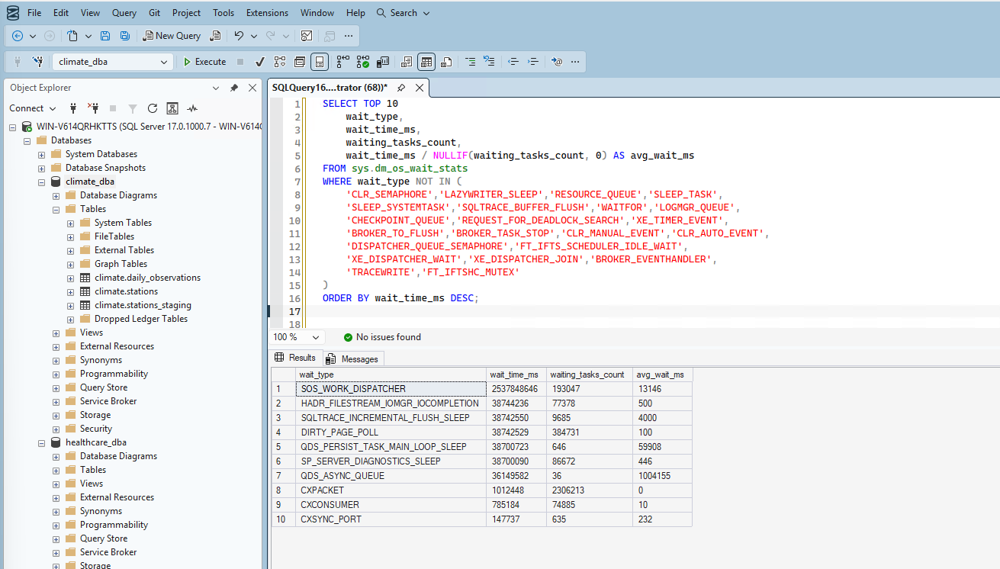
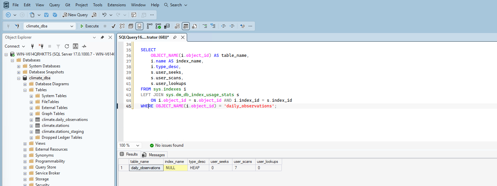
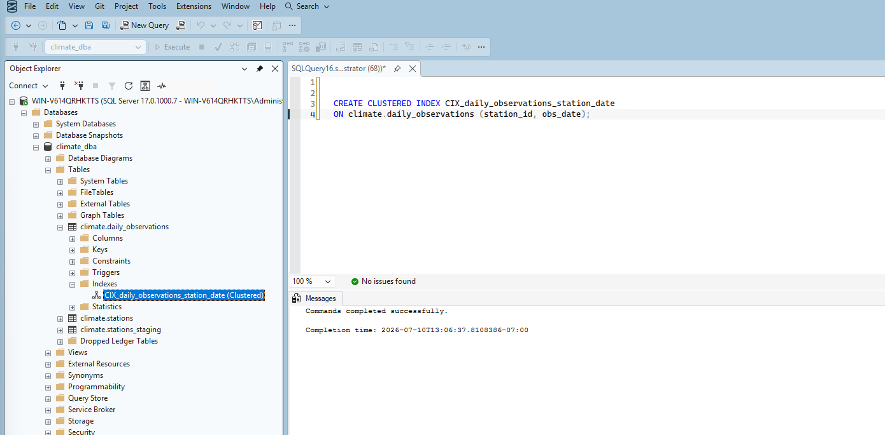
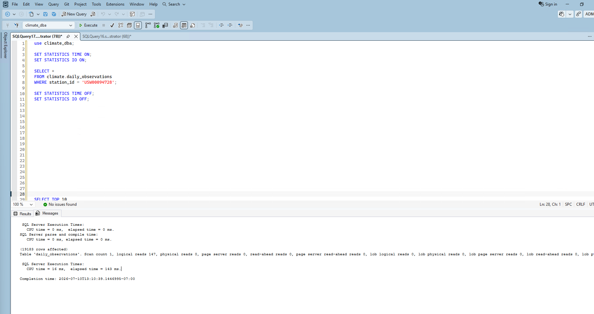
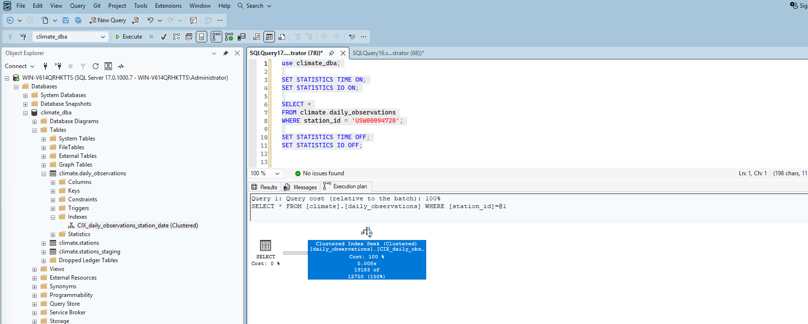
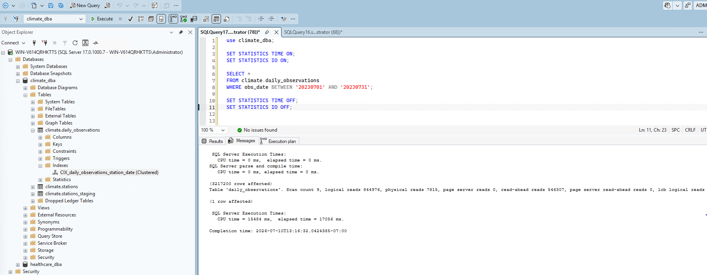
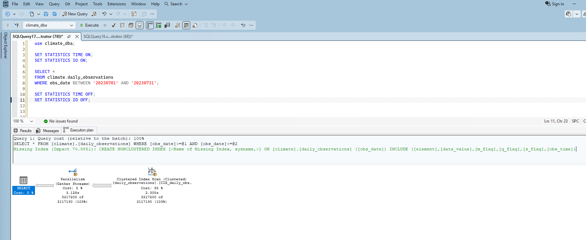

# Phase 4: Performance Tuning

## 1. Approach — measure first, diagnose with evidence, fix, re-measure

For this phase, I deliberately followed **Brent Ozar's** performance tuning philosophy — I'm a big fan of his approach and wanted to apply it properly rather than just accepting whatever SQL Server's built-in suggestions told me. His core principle is: measure first with real data, never guess, and treat the "missing index" DMV recommendations as a *hint*, not a to-do list to blindly execute. Every index has a real, ongoing cost (slower writes, more storage, more maintenance overhead) — so indexing should be based on evidence of real need, not speculation.

## 2. Captured a real wait-stats baseline

Before touching anything, I checked server-level wait statistics to see what SQL Server was actually spending time waiting on:

```sql
SELECT TOP 10 wait_type, wait_time_ms, waiting_tasks_count,
       wait_time_ms / NULLIF(waiting_tasks_count, 0) AS avg_wait_ms
FROM sys.dm_os_wait_stats
WHERE wait_type NOT IN (...)
ORDER BY wait_time_ms DESC;
```

My first attempt at the exclusion list was incomplete — several results I got back (`SOS_WORK_DISPATCHER`, `HADR_FILESTREAM_IOMGR_IOCOMPLETION`, `DIRTY_PAGE_POLL`, and others) turned out to be routine SQL Server housekeeping noise that accumulates just from the server being up and running, not real contention. I expanded the exclusion list and found the genuinely meaningful waits were **`CXPACKET`** (1,012,448 ms across 2,306,213 waiting tasks) and **`CXCONSUMER`** (785,184 ms across 74,885 tasks) — both parallelism synchronization waits, consistent with every full table scan run against a heap table in Phases 1 and 3.



## 3. Confirmed the heap state with real evidence

Before creating anything, I confirmed `climate.daily_observations` was genuinely a heap with zero index usage:

```sql
SELECT OBJECT_NAME(i.object_id) AS table_name, i.name AS index_name, i.type_desc,
       s.user_seeks, s.user_scans, s.user_lookups
FROM sys.indexes i
LEFT JOIN sys.dm_db_index_usage_stats s ON i.object_id = s.object_id AND i.index_id = s.index_id
WHERE OBJECT_NAME(i.object_id) = 'daily_observations';
```

Result: `HEAP`, 0 seeks, 7 scans — every query so far had done a full table scan.



## 4. Designed the indexing strategy around the real access pattern

Phase 1 surfaced two separate missing-index suggestions from SQL Server — one for `station_id` alone, one for `obs_date` alone. Rather than blindly creating both, I checked with the real expected access pattern first: queries will always filter by **`station_id` and `obs_date` together**, not either column in isolation.

That changes the design: a single **composite index** serves this pattern far better than two separate single-column indexes, since SQL Server can only efficiently use one nonclustered index per query — with a composite index, it can seek directly using both conditions at once.

**Column order:** I put `station_id` first, `obs_date` second — `station_id` has 132,501 distinct values (high cardinality, more selective), while `obs_date` only has ~1,095 possible values across 3 years. Leading with the more selective column gives a better seek target.

**Made it the clustered index** (not just nonclustered), since the table was a heap and needed real physical row ordering — a stronger fix than layering a nonclustered index on top of an unordered heap.

```sql
CREATE CLUSTERED INDEX CIX_daily_observations_station_date
ON climate.daily_observations (station_id, obs_date);
```

Building this on 113.5 million rows took real time and rewrote the entire table's physical storage.



## 5. Measured real impact — Query 1 (station_id filter)

I re-ran Phase 1's exact baseline query to get a clean before/after comparison:

```sql
SELECT * FROM climate.daily_observations WHERE station_id = 'USW00094728';
```

| Metric | Before (heap) | After (clustered index) | Change |
|---|---|---|---|
| Logical reads | 758,511 | 147 | **~5,160x fewer** |
| Scan count | 9 (parallel scan) | 1 (single seek) | No parallelism needed |
| Elapsed time | 1,658 ms | 143 ms | **~11.6x faster** |
| Rows returned | 19,183 | 19,183 | Identical — confirms correctness |



The execution plan confirmed a single **Clustered Index Seek** at 100% cost, replacing the old Table Scan + Parallelism plan entirely:



## 6. Measured real impact — Query 2 (obs_date range filter) — an honest non-improvement

I re-ran Phase 1's second baseline query — this one filters only by `obs_date`, with no `station_id` at all:

```sql
SELECT * FROM climate.daily_observations WHERE obs_date BETWEEN '20230701' AND '20230731';
```

| Metric | Before (heap) | After (clustered index) | Change |
|---|---|---|---|
| Logical reads | 758,511 | 844,976 | **Slightly worse** (+11.4%) |
| Scan count | 9 | 9 | No change |
| Elapsed time | 17,371 ms | 17,056 ms | Roughly flat (within noise) |
| Rows returned | 3,217,200 | 3,217,200 | Identical — confirms correctness |



The execution plan confirmed why: still a **Clustered Index Scan**, not a Seek — because `obs_date` is the *second* key in the composite index, a query filtering on `obs_date` alone can't seek directly to matching rows. SQL Server's own missing-index suggestion here recommended a separate nonclustered index on `obs_date` alone (70.89% estimated impact).



**This is a genuine, honest finding — not spun as a win.** The composite index dramatically helps the real expected access pattern (station_id, alone or combined with a date range), but does not help an isolated date-only query. That's exactly the trade-off I anticipated when designing the index, confirmed with real evidence rather than assumed.

## 7. Design decision: declined the supplementary obs_date index

SQL Server's missing-index suggestion for a standalone `obs_date` index was tempting to just apply — but I decided against it, channeling Brent Ozar's actual public stance on this kind of situation: the missing-index DMVs are a hint, not a to-do list. They don't know the real workload, and they don't account for the ongoing write-cost penalty every additional index adds to every future insert, forever.

The real expected access pattern (confirmed directly) is always `station_id` combined with `obs_date` — Phase 1's isolated date-range query was a synthetic baseline test I built specifically to establish an honest "before" state, not a representative real-world query. Indexing for a pattern that isn't part of the actual workload is exactly the kind of speculative over-indexing his methodology warns against.

**Decision:** no supplementary index added. If an isolated date-only access pattern turns out to matter in production, Phase 10's monitoring work should reveal it with real, repeated evidence — at which point it'd be a justified addition, not a guess.

## Summary

| Item | Before | After |
|---|---|---|
| Table structure | Heap | Clustered index on (station_id, obs_date) |
| Query 1 (station_id) — logical reads | 758,511 | 147 |
| Query 1 (station_id) — elapsed time | 1,658 ms | 143 ms |
| Query 1 (station_id) — plan | Table Scan + Parallelism | Clustered Index Seek |
| Query 2 (obs_date range) — logical reads | 758,511 | 844,976 (slightly worse) |
| Query 2 (obs_date range) — elapsed time | 17,371 ms | 17,056 ms (flat) |
| Query 2 (obs_date range) — plan | Table Scan + Parallelism | Clustered Index Scan (still not a seek) |
| Supplementary obs_date index | N/A | Deliberately not added — no evidence of real need |

## What's Next

With a real indexing strategy in place, validated against the actual expected workload rather than blind application of every suggestion, Phase 5 moves into backup and recovery — full/differential/log backup strategy design and a real point-in-time restore drill.
