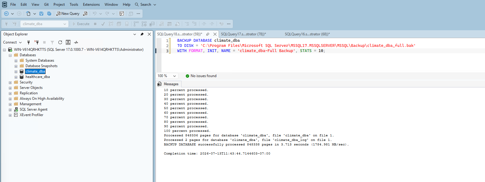
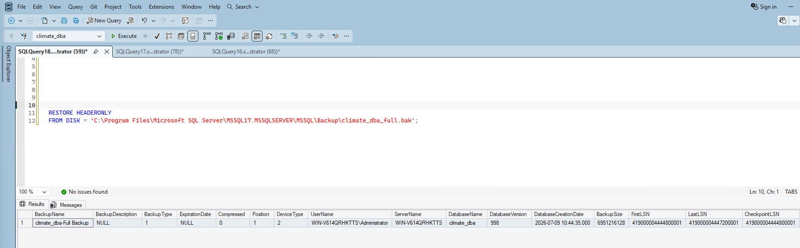
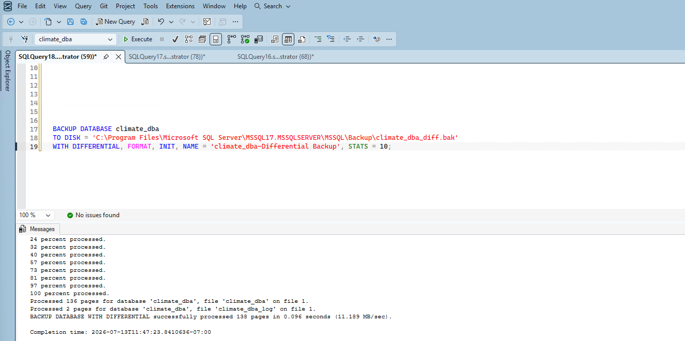
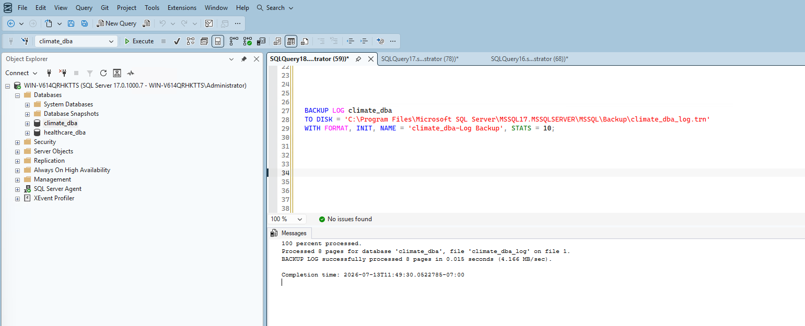
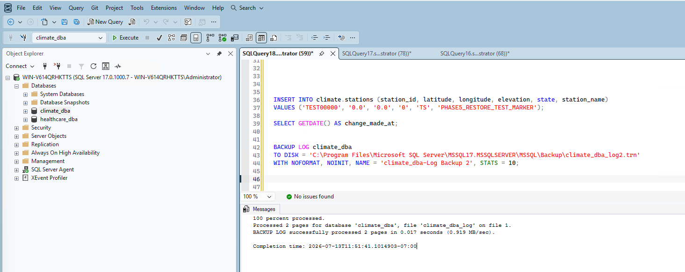
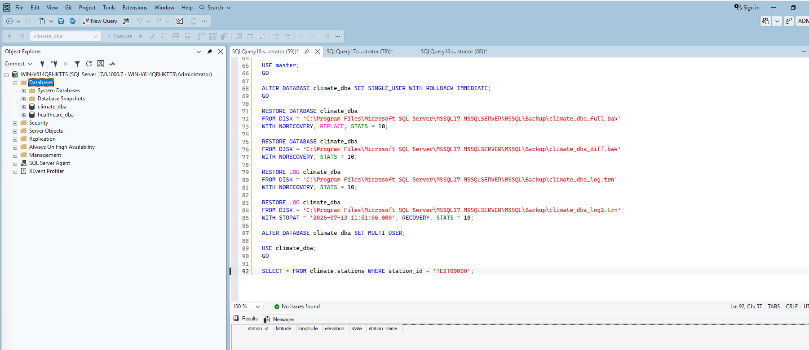

# Phase 5: Backup & Recovery

## 1. Designed the backup strategy against a real RPO requirement

Before writing any backup commands, I established a real constraint to design against: the maximum acceptable data loss (RPO — Recovery Point Objective) is **10 minutes**. Rather than picking an arbitrary schedule, I built the strategy backward from that number.

Since log backups are what actually control RPO (they capture every transaction between backups), I set **log backups to run every 5 minutes** — a 2x safety margin under the 10-minute ceiling, so a single missed or delayed job still keeps me within requirement before the next one runs.

**Backup schedule:**

| Backup type | Frequency | Reasoning |
|---|---|---|
| Full | Weekly | Standard practice — differentials and logs handle everything in between |
| Differential | Daily | Captures a day's changes without a full backup's overhead |
| Transaction log | Every 5 minutes | Meets the 10-minute RPO with a 2x safety margin |

## 2. Took a full backup

```sql
BACKUP DATABASE climate_dba
TO DISK = 'C:\...\Backup\climate_dba_full.bak'
WITH FORMAT, INIT, NAME = 'climate_dba-Full Backup', STATS = 10;
```

Real result: **848,336 pages processed in 3.713 seconds** (1784.981 MB/sec).



I verified the backup file was valid by reading its header without restoring anything:

```sql
RESTORE HEADERONLY FROM DISK = 'C:\...\Backup\climate_dba_full.bak';
```

Confirmed: Full backup type, ~6.47GB size, Full recovery model.



## 3. Took a differential backup

```sql
BACKUP DATABASE climate_dba
TO DISK = 'C:\...\Backup\climate_dba_diff.bak'
WITH DIFFERENTIAL, FORMAT, INIT, NAME = 'climate_dba-Differential Backup', STATS = 10;
```

Real result: only **136 pages processed in 0.096 seconds** — confirms the differential mechanism correctly captured just the small amount of changes since the full backup, not the entire database again.



## 4. Took a transaction log backup

```sql
BACKUP LOG climate_dba
TO DISK = 'C:\...\Backup\climate_dba_log.trn'
WITH FORMAT, INIT, NAME = 'climate_dba-Log Backup', STATS = 10;
```

Real result: 8 pages processed in 0.015 seconds.



## 5. Ran a real point-in-time recovery drill

Taking backups proves nothing on its own — I wanted real, verified evidence that the backup chain actually enables recovery to a specific moment, not just to the last backup taken. Here's the drill I ran:

**Step 1 — Made an identifiable change:**

```sql
INSERT INTO climate.stations (station_id, latitude, longitude, elevation, state, station_name)
VALUES ('TEST00000', '0.0', '0.0', '0', 'TS', 'PHASE5_RESTORE_TEST_MARKER');
```

Timestamp of change: **2026-07-13 11:51:06.477**

**Step 2 — Captured the change in a second log backup:**

```sql
BACKUP LOG climate_dba
TO DISK = 'C:\...\Backup\climate_dba_log2.trn'
WITH NOFORMAT, NOINIT, NAME = 'climate_dba-Log Backup 2', STATS = 10;
```



I confirmed the test marker genuinely existed before attempting anything else.

**Step 3 — Executed the restore chain:**

```sql
-- Disconnect other users, since we're overwriting the live database
ALTER DATABASE climate_dba SET SINGLE_USER WITH ROLLBACK IMMEDIATE;

-- Restore full backup, NORECOVERY (keeps DB in restoring state)
RESTORE DATABASE climate_dba
FROM DISK = 'C:\...\Backup\climate_dba_full.bak'
WITH NORECOVERY, REPLACE, STATS = 10;

-- Restore differential, still NORECOVERY
RESTORE DATABASE climate_dba
FROM DISK = 'C:\...\Backup\climate_dba_diff.bak'
WITH NORECOVERY, STATS = 10;

-- Restore first log backup, still NORECOVERY
RESTORE LOG climate_dba
FROM DISK = 'C:\...\Backup\climate_dba_log.trn'
WITH NORECOVERY, STATS = 10;

-- Restore second log backup, but STOP just before the test insert -
-- this is the actual point-in-time mechanism. RECOVERY brings the
-- database back online since this is the final step.
RESTORE LOG climate_dba
FROM DISK = 'C:\...\Backup\climate_dba_log2.trn'
WITH STOPAT = '2026-07-13 11:51:06.000', RECOVERY, STATS = 10;
```

**Step 4 — Verified the restore actually worked:**

```sql
ALTER DATABASE climate_dba SET MULTI_USER;

SELECT * FROM climate.stations WHERE station_id = 'TEST00000';
```

**Result: zero rows returned.** This is the most important evidence in this entire phase — real, verified proof that restoring to `11:51:06.000` genuinely recovered the database to a moment *before* the test insert at `11:51:06.477` happened.



**Step 5 — Confirmed the rest of the database survived intact**, not just that the test row was removed:

```sql
SELECT COUNT(*) AS total_rows FROM climate.daily_observations;
SELECT COUNT(*) AS total_stations FROM climate.stations;
```

Results: **113,522,932** observation rows (unchanged) and **132,501** stations — exactly one less than it would be with the test marker still present, confirming the restore removed precisely the test row and nothing else.


## 6. Disaster Recovery Plan

### Recovery Objectives

| Objective | Target | Basis |
|---|---|---|
| **RPO** (max acceptable data loss) | 10 minutes | Business requirement |
| **RTO** (max acceptable recovery time) | Under 30 minutes | Real measured restore time (~15 seconds of pure processing) plus operational overhead |

### Backup Schedule

- **Full backup:** Weekly (e.g., Sunday 2 AM)
- **Differential backup:** Daily (e.g., 2 AM, all days except Sunday)
- **Transaction log backup:** Every 5 minutes, continuously

### Restore Procedure (in order)

1. Set the database to `SINGLE_USER WITH ROLLBACK IMMEDIATE` to disconnect active sessions
2. Restore the most recent full backup with `NORECOVERY`
3. Restore the most recent differential backup (if one exists since the full) with `NORECOVERY`
4. Restore each transaction log backup in sequence since the differential/full, with `NORECOVERY`
5. Restore the final log backup with `RECOVERY` (and `STOPAT` if a specific point-in-time is needed rather than the latest available point)
6. Set the database back to `MULTI_USER`
7. Verify data integrity with row counts / spot checks before considering recovery complete

### Verified Evidence

This isn't a theoretical procedure — every step above was executed and verified for real in this phase, including a genuine point-in-time recovery drill that proved the mechanism works as designed.

## Summary

| Item | Result |
|---|---|
| Full backup | 848,336 pages, 3.713 seconds |
| Differential backup | 136 pages, 0.096 seconds |
| Log backup | 8 pages, 0.015 seconds |
| Point-in-time restore drill | Verified — test marker inserted, captured, then genuinely absent after restore |
| Post-restore data integrity | Confirmed intact — 113,522,932 observations, 132,501 stations |
| RPO | 10 minutes (business requirement) |
| RTO | Under 30 minutes (based on real measured restore times) |

## What's Next

With a verified, working backup and recovery strategy in place, Phase 6 moves into security — authentication model, roles and permissions, Transparent Data Encryption, Row-Level Security, and data masking.
