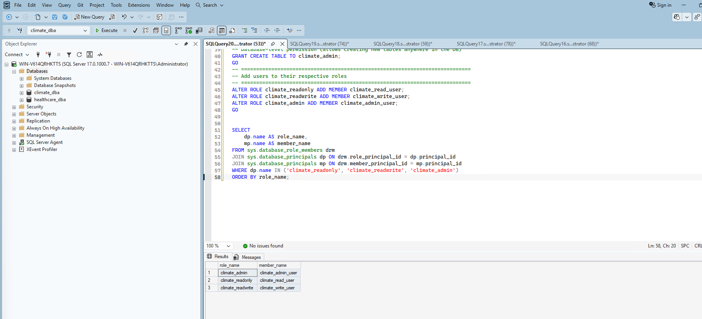
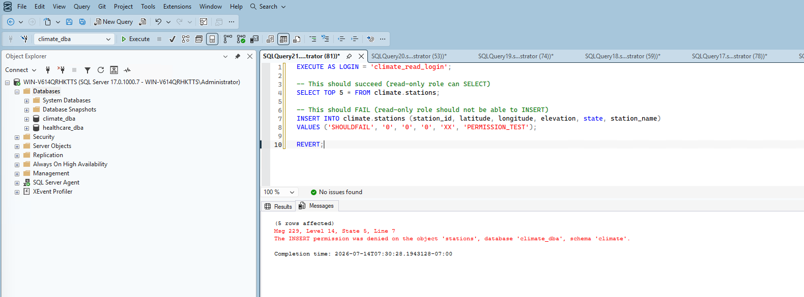
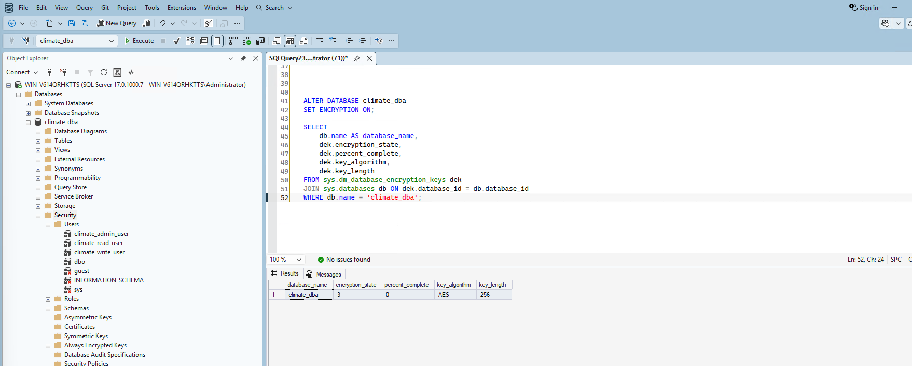
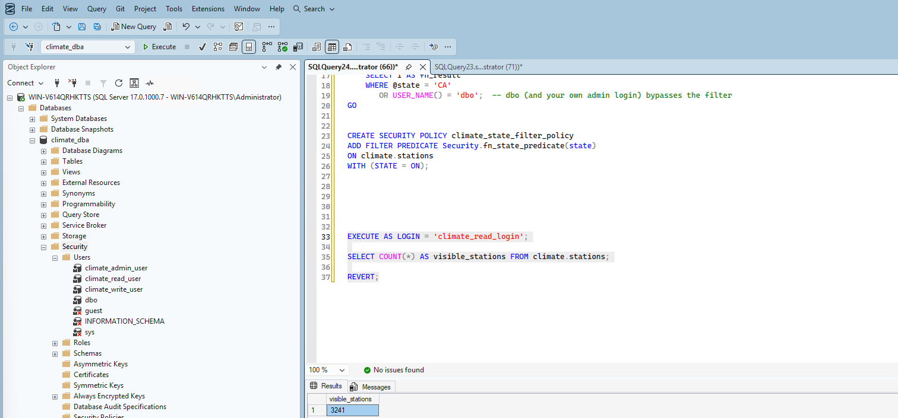
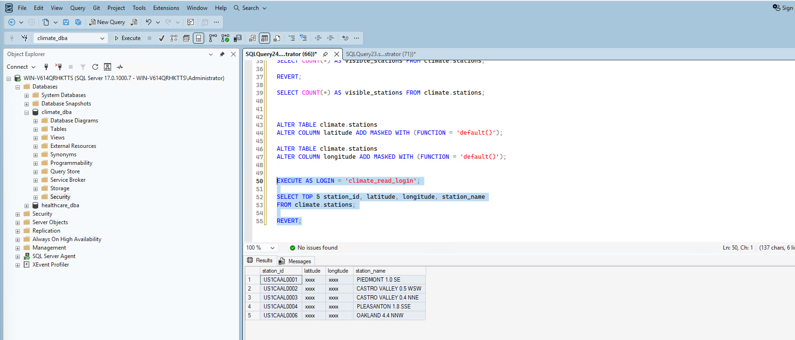

# Phase 6: Security

## 1. Audited the current security state

Before designing anything, I checked what principals already existed against `climate_dba`:

```sql
SELECT dp.name AS principal_name, dp.type_desc, dp.authentication_type_desc
FROM sys.database_principals dp
WHERE dp.type NOT IN ('R') AND dp.name NOT LIKE '##%'
ORDER BY dp.name;
```

Result: only the built-in principals SQL Server creates automatically (`dbo`, `guest`, `INFORMATION_SCHEMA`, `sys`) — confirming I was designing security completely from scratch.

## 2. Built a least-privilege role model with real logins

I designed three roles around realistic access patterns:

- **`climate_readonly`** — SELECT only, for reporting/analytics users
- **`climate_readwrite`** — SELECT, INSERT, UPDATE, DELETE, for an application or ETL process
- **`climate_admin`** — full control over the `climate` schema, for a DBA/developer doing schema changes without full server-level `sysadmin` rights

I created real SQL logins and users mapped to each role, rather than just designing the roles on paper:

```sql
CREATE LOGIN climate_read_login WITH PASSWORD = '...', CHECK_POLICY = ON;
CREATE LOGIN climate_write_login WITH PASSWORD = '...', CHECK_POLICY = ON;
CREATE LOGIN climate_admin_login WITH PASSWORD = '...', CHECK_POLICY = ON;

CREATE USER climate_read_user FOR LOGIN climate_read_login;
CREATE USER climate_write_user FOR LOGIN climate_write_login;
CREATE USER climate_admin_user FOR LOGIN climate_admin_login;

CREATE ROLE climate_readonly;
CREATE ROLE climate_readwrite;
CREATE ROLE climate_admin;

GRANT SELECT ON SCHEMA::climate TO climate_readonly;
GRANT SELECT, INSERT, UPDATE, DELETE ON SCHEMA::climate TO climate_readwrite;
```

**Real troubleshooting:** my first attempt at granting `climate_admin`'s permissions included `CREATE TABLE` scoped to the schema (`GRANT ... CREATE TABLE ON SCHEMA::climate`), which failed with `Msg 102, Incorrect syntax`. `CREATE TABLE` is a database-level permission in SQL Server, not something that can be scoped to a specific schema via `GRANT ... ON SCHEMA::`. I fixed this by splitting it into two separate statements:

```sql
GRANT SELECT, INSERT, UPDATE, DELETE, ALTER ON SCHEMA::climate TO climate_admin;
GRANT CREATE TABLE TO climate_admin;
```

I verified all three users landed in their correct roles:



**I didn't stop at configuration — I tested it.** I ran a real permission check as `climate_read_login`, confirming SELECT succeeded but INSERT was genuinely denied:

```sql
EXECUTE AS LOGIN = 'climate_read_login';
SELECT TOP 5 * FROM climate.stations;  -- succeeded
INSERT INTO climate.stations (...) VALUES (...);  -- failed
REVERT;
```

Result: `Msg 229, The INSERT permission was denied on the object 'stations'...` — real, verified proof the read-only role genuinely cannot write, not just a permission model that looks right on paper.



## 3. Enabled Transparent Data Encryption (TDE)

TDE encrypts the entire database at rest — if someone stole the physical `.mdf`/`.ldf` files, they'd be unreadable without the encryption certificate.

**Setup sequence:**

```sql
USE master;
CREATE MASTER KEY ENCRYPTION BY PASSWORD = '...';
CREATE CERTIFICATE climate_dba_tde_cert WITH SUBJECT = 'Certificate for climate_dba TDE';
```

**Critical step — backed up the certificate immediately.** Losing this certificate without a backup means permanently losing access to the encrypted database, even with full database backups (which would also be encrypted and unreadable without it):

```sql
BACKUP CERTIFICATE climate_dba_tde_cert
TO FILE = 'C:\ClimateData\climate_dba_tde_cert.cer'
WITH PRIVATE KEY (
    FILE = 'C:\ClimateData\climate_dba_tde_cert.pvk',
    ENCRYPTION BY PASSWORD = '...'
);
```

```sql
USE climate_dba;
CREATE DATABASE ENCRYPTION KEY
WITH ALGORITHM = AES_256
ENCRYPTION BY SERVER CERTIFICATE climate_dba_tde_cert;

ALTER DATABASE climate_dba SET ENCRYPTION ON;
```

I checked encryption state twice — my first check showed `encryption_state = 2` (In Progress) at 48.47% complete, since encrypting a ~7GB database takes real time. The second check confirmed completion:

```sql
SELECT db.name, dek.encryption_state, dek.percent_complete, dek.key_algorithm, dek.key_length
FROM sys.dm_database_encryption_keys dek
JOIN sys.databases db ON dek.database_id = db.database_id
WHERE db.name = 'climate_dba';
```

Result: `encryption_state = 3` (Encrypted), `percent_complete = 0`, AES-256 — TDE genuinely active.



## 4. Implemented Row-Level Security (RLS)

**Scenario:** restrict `climate_read_user` to only see stations (and by extension, their data) from California — simulating a regional analyst who should only access their assigned region, not the entire nationwide dataset.

I confirmed the real CA station count first, to verify the policy against afterward:

```sql
SELECT COUNT(*) AS ca_station_count FROM climate.stations WHERE state = 'CA';
```

Result: **3,241** CA stations out of 132,501 total.

I built a security predicate function and attached it as a filter policy:

```sql
CREATE SCHEMA Security;

CREATE FUNCTION Security.fn_state_predicate(@state VARCHAR(10))
RETURNS TABLE
WITH SCHEMABINDING
AS
RETURN
    SELECT 1 AS fn_result
    WHERE @state = 'CA'
       OR USER_NAME() = 'dbo';

CREATE SECURITY POLICY climate_state_filter_policy
ADD FILTER PREDICATE Security.fn_state_predicate(state)
ON climate.stations
WITH (STATE = ON);
```

**Verified with real evidence, both directions:**

```sql
EXECUTE AS LOGIN = 'climate_read_login';
SELECT COUNT(*) AS visible_stations FROM climate.stations;
REVERT;
```

Result: **3,241** — exactly the CA-only count, confirming the policy genuinely filters rows for this user.

```sql
SELECT COUNT(*) AS visible_stations FROM climate.stations;  -- under my own admin context
```

Result: **132,501** — full table visible, confirming the `dbo` bypass condition works correctly and doesn't accidentally restrict privileged access.



## 5. Applied Dynamic Data Masking

I masked `latitude` and `longitude` — treating precise geographic coordinates as sensitive location data that lower-privilege users shouldn't see in full precision:

```sql
ALTER TABLE climate.stations
ALTER COLUMN latitude ADD MASKED WITH (FUNCTION = 'default()');

ALTER TABLE climate.stations
ALTER COLUMN longitude ADD MASKED WITH (FUNCTION = 'default()');
```

**Verified as `climate_read_login`:**

```sql
SELECT TOP 5 station_id, latitude, longitude, station_name FROM climate.stations;
```

Result: `latitude` and `longitude` both showed `xxxx`, while `station_id` and `station_name` remained visible normally. As a nice side-confirmation, all 5 rows returned were CA stations (`US1CA...` prefixes) — proving RLS and masking are working together correctly, not just individually.



**Verified under my own admin context** that real, unmasked coordinates are still visible — confirming masking, like RLS, doesn't affect privileged users.

## Summary

| Security layer | Status | Verification |
|---|---|---|
| Least-privilege roles | ✅ Implemented | Read-only role genuinely denied INSERT (Msg 229) |
| Real logins/users | ✅ Created | 3 logins mapped to 3 roles, confirmed via role membership query |
| TDE | ✅ Enabled | `encryption_state = 3`, AES-256, certificate backed up |
| Row-Level Security | ✅ Implemented | `climate_read_login` sees 3,241 (CA only); admin sees 132,501 |
| Dynamic Data Masking | ✅ Implemented | `climate_read_login` sees masked lat/long; admin sees real values |

## What's Next

With a genuinely tested security model in place — not just configured, but verified with real evidence at every layer — Phase 7 moves into auditing and compliance: SQL Server Audit, login auditing, and change tracking.
