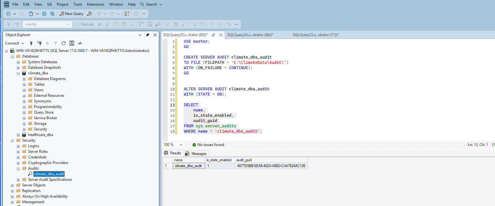
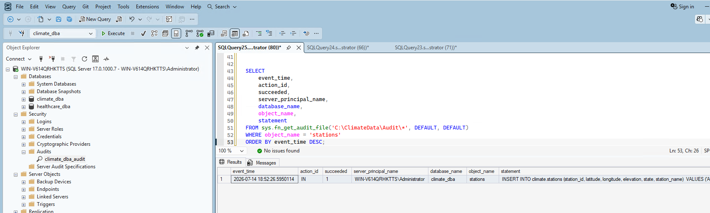
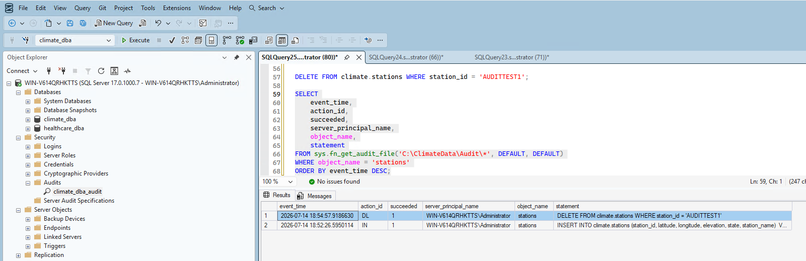
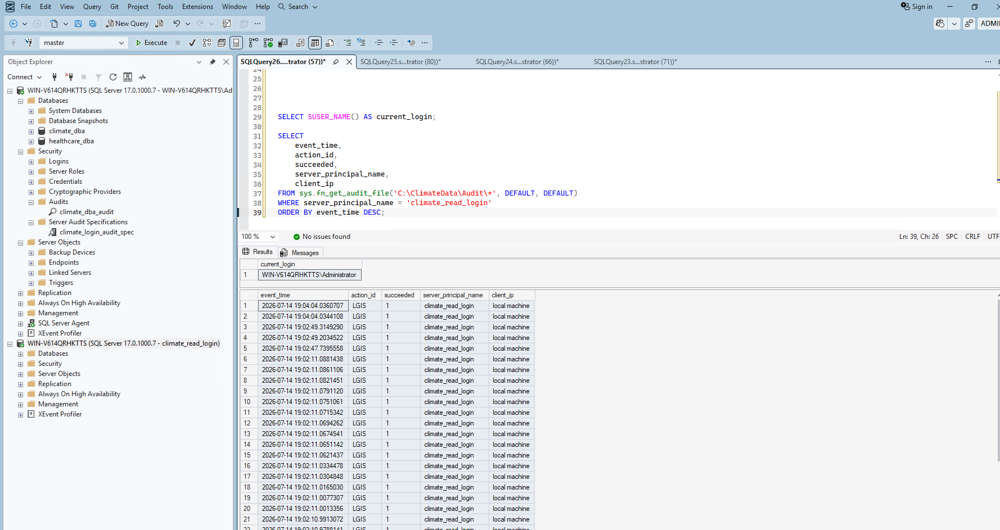
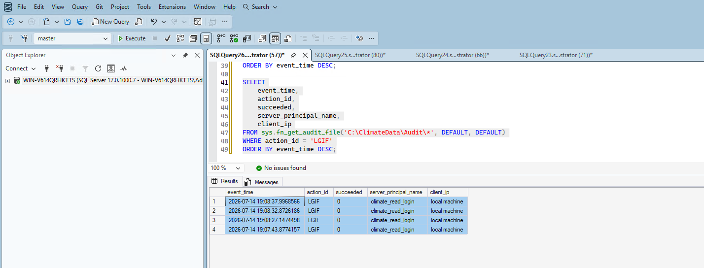
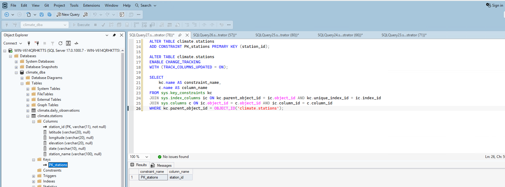
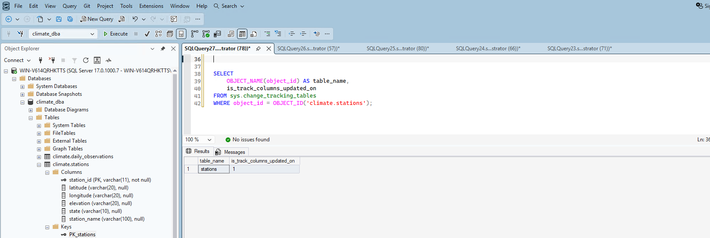
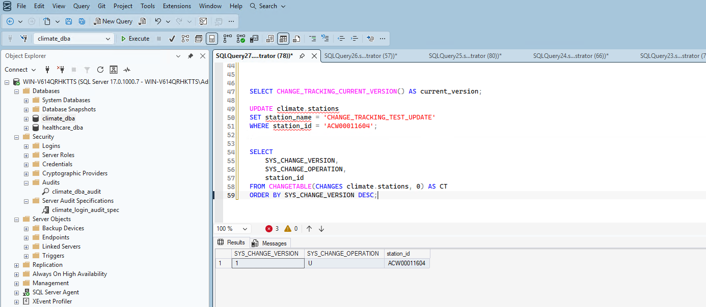

# Phase 7: Auditing & Compliance

## 1. Created and enabled a Server Audit

The Server Audit is the top-level object that defines where audit output gets written:

```sql
CREATE SERVER AUDIT climate_dba_audit
TO FILE (FILEPATH = 'C:\ClimateData\Audit\')
WITH (ON_FAILURE = CONTINUE);
```

**Real troubleshooting:** my first attempt failed with `Msg 33072, The audit log file path is invalid`. I'd assumed SQL Server would create the target folder automatically — it doesn't. I had to create `C:\ClimateData\Audit\` inside the VM manually first, then the command succeeded.

```sql
ALTER SERVER AUDIT climate_dba_audit WITH (STATE = ON);
```

My first verification attempt also failed — I queried `status_desc` and `audit_file_path`, neither of which exist on `sys.server_audits` (`Msg 207, Invalid column name`). The correct columns are `name`, `is_state_enabled`, `audit_guid`:

```sql
SELECT name, is_state_enabled, audit_guid FROM sys.server_audits WHERE name = 'climate_dba_audit';
```

Confirmed `is_state_enabled = 1`.



## 2. Created a Database Audit Specification

This defines *what* gets audited within `climate_dba` — I chose to audit data changes (INSERT/UPDATE/DELETE) on the `climate` schema, plus schema and permission changes:

```sql
CREATE DATABASE AUDIT SPECIFICATION climate_dba_audit_spec
FOR SERVER AUDIT climate_dba_audit
ADD (SCHEMA_OBJECT_CHANGE_GROUP),
ADD (DATABASE_OBJECT_PERMISSION_CHANGE_GROUP),
ADD (INSERT, UPDATE, DELETE ON SCHEMA::climate BY public)
WITH (STATE = ON);
```

## 3. Verified auditing actually captures real events

Configuration alone proves nothing — I tested it with a real, identifiable INSERT:

```sql
INSERT INTO climate.stations (station_id, latitude, longitude, elevation, state, station_name)
VALUES ('AUDITTEST1', '0.0', '0.0', '0', 'TS', 'PHASE7_AUDIT_TEST_MARKER');
```

Querying the audit log confirmed it was captured with the full statement text, timestamp, and principal:

```sql
SELECT event_time, action_id, succeeded, server_principal_name, database_name, object_name, statement
FROM sys.fn_get_audit_file('C:\ClimateData\Audit\*', DEFAULT, DEFAULT)
WHERE object_name = 'stations'
ORDER BY event_time DESC;
```



I cleaned up the test row with a DELETE, and confirmed that operation was captured too — a second real, independent audit event:



## 4. Set up and verified login auditing

I added successful and failed login tracking to the server audit:

```sql
CREATE SERVER AUDIT SPECIFICATION climate_login_audit_spec
FOR SERVER AUDIT climate_dba_audit
ADD (FAILED_LOGIN_GROUP),
ADD (SUCCESSFUL_LOGIN_GROUP)
WITH (STATE = ON);
```

**Tested the successful case:** I connected as `climate_read_login` in a new SSMS window, then queried the audit log. My first attempt at checking failed — I'd accidentally run the query while still connected *as* `climate_read_login`, which correctly errored (`Msg 300, VIEW SERVER SECURITY AUDIT permission was denied`) since that account genuinely doesn't have permission to view the audit log — itself a reasonable security boundary, not a bug. Re-running from my admin connection showed multiple real `LGIS` (Login Success) events:



**Tested the failure case:** I deliberately entered a wrong password for `climate_read_login` and confirmed a real login failure on screen. Checking the audit log (from my admin connection) showed genuine `LGIF` (Login Failed) events with `succeeded = 0`:



## 5. Enabled Change Tracking — and hit a real, honest schema limitation

I enabled Change Tracking at the database level:

```sql
ALTER DATABASE climate_dba
SET CHANGE_TRACKING = ON
(CHANGE_RETENTION = 7 DAYS, AUTO_CLEANUP = ON);
```

I chose `climate.stations` (132,501 rows) over `daily_observations` (113.5 million rows) to demonstrate the mechanism without unnecessary overhead. But enabling it failed immediately:

```
Msg 4997: Cannot enable change tracking on table 'stations'. Change tracking requires a primary key.
```

This is a real, honest consequence of Phase 1's deliberate design — `climate.stations` was built with no primary key at all, on purpose, to match a naive "before" state. Rather than skip Change Tracking, I decided to properly fix this: `station_id` is a genuine natural key (every row has a unique value), so adding a primary key here is a legitimate schema improvement, not a workaround.

Getting there took two more real errors. First, adding the primary key directly failed:

```
Msg 8111: Cannot define PRIMARY KEY constraint on nullable column
```

`station_id` had never been marked `NOT NULL`. I fixed that first (after confirming no existing rows actually had NULL values):

```sql
ALTER TABLE climate.stations
ALTER COLUMN station_id VARCHAR(11) NOT NULL;
```

Then the primary key:

```sql
ALTER TABLE climate.stations
ADD CONSTRAINT PK_stations PRIMARY KEY (station_id);
```



With the primary key in place, Change Tracking finally enabled successfully:

```sql
ALTER TABLE climate.stations
ENABLE CHANGE_TRACKING
WITH (TRACK_COLUMNS_UPDATED = ON);
```



## 6. Verified Change Tracking captures real row-level changes

```sql
SELECT CHANGE_TRACKING_CURRENT_VERSION() AS current_version;  -- baseline: 0

UPDATE climate.stations
SET station_name = 'CHANGE_TRACKING_TEST_UPDATE'
WHERE station_id = 'ACW00011604';

SELECT SYS_CHANGE_VERSION, SYS_CHANGE_OPERATION, station_id
FROM CHANGETABLE(CHANGES climate.stations, 0) AS CT
ORDER BY SYS_CHANGE_VERSION DESC;
```

Result: version incremented from 0 to 1, with `SYS_CHANGE_OPERATION = 'U'` correctly showing the update against `station_id = 'ACW00011604'` — real, verified proof the mechanism works.



I reverted the test change afterward to leave the data clean.

## Summary

| Item | Status | Verification |
|---|---|---|
| Server Audit | ✅ Enabled | `is_state_enabled = 1` |
| Database Audit Specification | ✅ Enabled | Real INSERT and DELETE captured with full statement text |
| Login auditing (success) | ✅ Verified | Real `LGIS` events for `climate_read_login` |
| Login auditing (failure) | ✅ Verified | Real `LGIF` events with `succeeded = 0` |
| Change Tracking | ✅ Enabled | Required adding a genuine primary key to `stations` first — a real schema fix, not a workaround |
| Change Tracking test | ✅ Verified | Real UPDATE correctly captured as version 1, operation 'U' |

## What's Next

With auditing and change tracking genuinely verified — including an honest schema limitation discovered and properly fixed along the way — Phase 8 moves into SQL Server Agent and automation: scheduled jobs, automated backups, and alerting.
