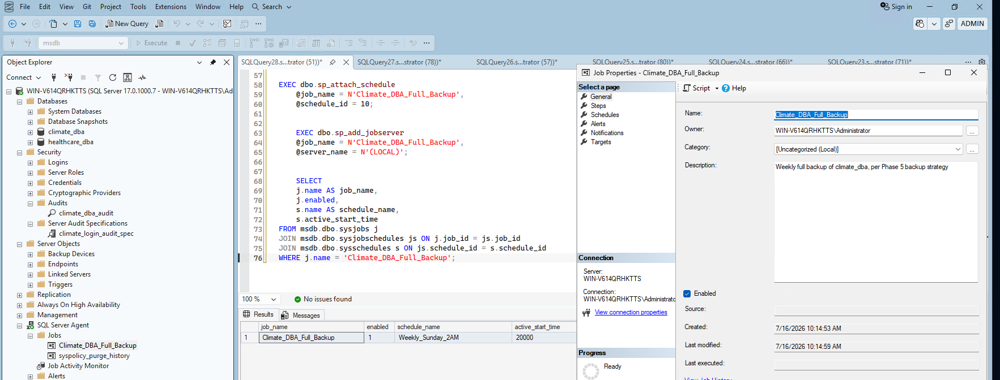
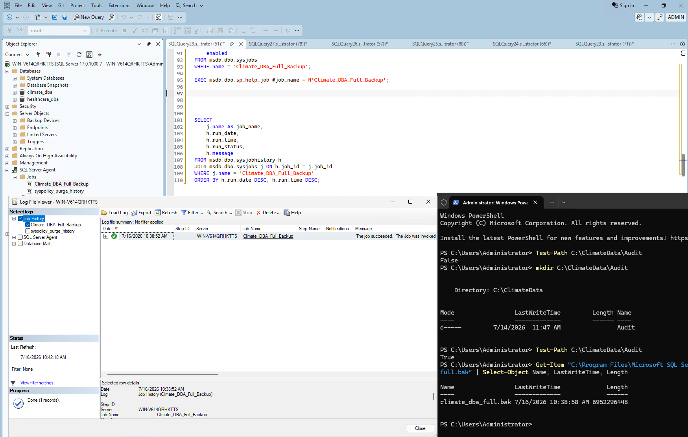
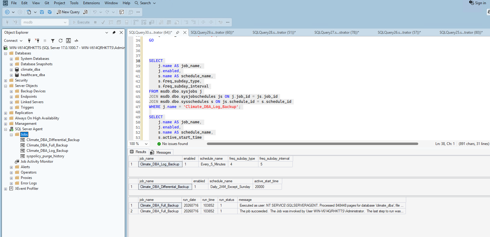
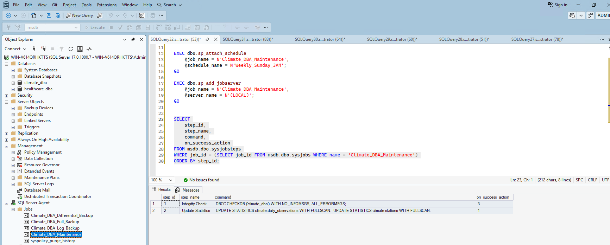
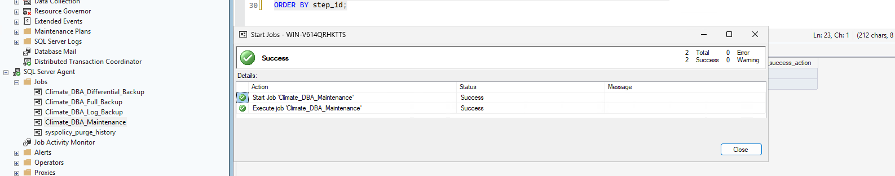
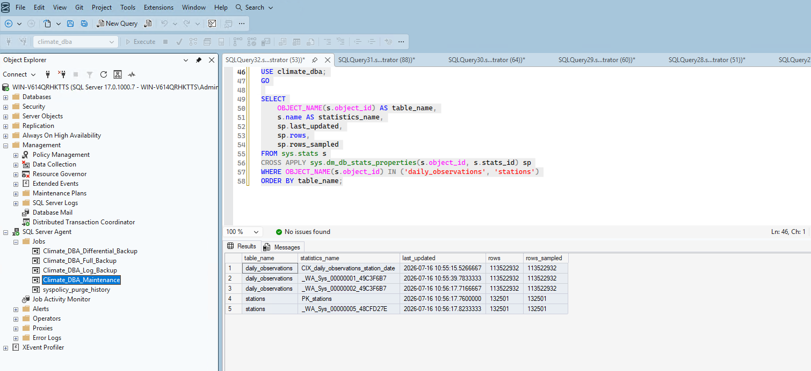
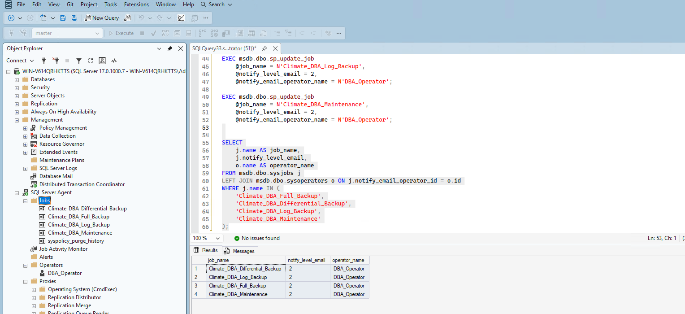
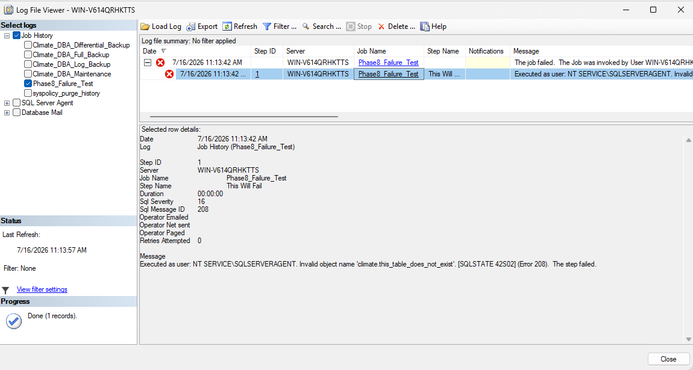

# Phase 8: SQL Server Agent & Automation

## 1. Confirmed SQL Server Agent is running

Before automating anything, I re-confirmed Agent's status (verified initially back in Phase 2):

```sql
SELECT servicename, status_desc, startup_type_desc
FROM sys.dm_server_services
WHERE servicename LIKE '%Agent%';
```

Confirmed: Running, Automatic startup.

## 2. Automated Phase 5's full backup

I created a job to automate the weekly full backup:

```sql
EXEC dbo.sp_add_job @job_name = N'Climate_DBA_Full_Backup', @enabled = 1, ...;
EXEC dbo.sp_add_jobstep @job_name = N'Climate_DBA_Full_Backup', @step_name = N'Run Full Backup', ...;
```

**Real troubleshooting:** my first `sp_add_schedule` call for the weekly schedule accidentally ran more than once, creating 4 duplicate schedules with the identical name. This caused `Msg 14371` (ambiguous schedule name) when I tried attaching it to the job. I checked `msdb.dbo.sysschedules`, confirmed 4 duplicate IDs existed, deleted 3 of them, and attached using the remaining schedule's ID directly rather than its name.

```sql
EXEC dbo.sp_attach_schedule @job_name = N'Climate_DBA_Full_Backup', @schedule_id = 10;
EXEC dbo.sp_add_jobserver @job_name = N'Climate_DBA_Full_Backup', @server_name = N'(LOCAL)';
```

I verified the job's configuration:



**Real finding worth documenting honestly:** calling `sp_start_job` via T-SQL didn't actually trigger execution in my session — `sysjobactivity` showed `NULL` start/stop times and `last_run_outcome = 5` (Unknown/never run) even though the call returned without error. Running the same job through the SSMS GUI (right-click → Start Job at Step) worked correctly. I confirmed this genuinely produced a real backup by checking the file directly inside the VM:

```powershell
Get-Item "C:\...\Backup\climate_dba_full.bak" | Select-Object Name, LastWriteTime, Length
```

Result: a real file with a fresh timestamp and ~6.95GB size, matching Phase 5's numbers.



## 3. Automated the differential and log backup jobs

I repeated the same pattern for the remaining two backup types, matching Phase 5's schedule design:

- **Differential:** daily, except Sunday (using a bitmask `freq_interval = 62` to represent Mon–Sat)
- **Log backup:** every 5 minutes, directly automating Phase 5's 10-minute RPO requirement with a 2x safety margin

```sql
EXEC dbo.sp_add_schedule @schedule_name = N'Daily_2AM_Except_Sunday', @freq_type = 8, @freq_interval = 62, ...;
EXEC dbo.sp_add_schedule @schedule_name = N'Every_5_Minutes', @freq_type = 4, @freq_subday_type = 4, @freq_subday_interval = 5, ...;
```

All three backup jobs now exist, scheduled correctly:



## 4. Automated Phase 3's maintenance routine

I built a two-step job — integrity check first, then statistics update — matching Phase 3's manual maintenance work:

```sql
EXEC dbo.sp_add_jobstep @step_name = N'Integrity Check',
    @command = N'DBCC CHECKDB (''climate_dba'') WITH NO_INFOMSGS, ALL_ERRORMSGS;',
    @on_success_action = 3;  -- go to next step

EXEC dbo.sp_add_jobstep @step_name = N'Update Statistics',
    @command = N'UPDATE STATISTICS climate.daily_observations WITH FULLSCAN;
UPDATE STATISTICS climate.stations WITH FULLSCAN;';
```

**Real troubleshooting:** adding the schedule initially failed with `Msg 2812` (could not find stored procedure) — my session context wasn't set to `msdb`. Adding `USE msdb;` fixed it immediately.

I verified the two steps were sequenced correctly:



I ran the job manually through the GUI — both steps succeeded ("2 Total, 2 Success"):



I didn't just trust the GUI's success message — I verified the statistics were genuinely refreshed:

```sql
SELECT OBJECT_NAME(s.object_id) AS table_name, s.name, sp.last_updated, sp.rows, sp.rows_sampled
FROM sys.stats s
CROSS APPLY sys.dm_db_stats_properties(s.object_id, s.stats_id) sp
WHERE OBJECT_NAME(s.object_id) IN ('daily_observations', 'stations');
```

Every statistics object showed a fresh timestamp with `rows_sampled` exactly matching `rows` — confirming the `FULLSCAN` genuinely ran, not just that the job reported success.



## 5. Configured job failure notifications — with an honest limitation

I checked whether Database Mail was already configured:

```sql
SELECT name, description FROM msdb.dbo.sysmail_profile;
```

Result: no rows. **Database Mail is not configured in this lab environment** — setting it up requires a real SMTP server and credentials, which I don't have available here. Rather than invent fake credentials or skip this part of Phase 8 entirely, I built the alert infrastructure to demonstrate the mechanism correctly, while being upfront about this limitation.

I created an operator:

```sql
EXEC msdb.dbo.sp_add_operator @name = N'DBA_Operator', @enabled = 1, @email_address = N'dba@example.com';
```

**Real troubleshooting — a genuine design mistake I made and corrected:** my first approach used `sp_add_alert` with `@message_id = 0` and `@severity = 0`, intending this to mean "notify on any job failure." This failed with `Msg 14500` — it turns out `sp_add_alert` triggers on SQL Server error log messages/severities, not job outcomes directly. The correct mechanism for job-failure notification is attaching notification directly to the job itself via `sp_update_job`:

```sql
EXEC msdb.dbo.sp_update_job
    @job_name = N'Climate_DBA_Full_Backup',
    @notify_level_email = 2,  -- notify only on failure
    @notify_email_operator_name = N'DBA_Operator';
```

I repeated this for all four jobs and verified:



## 6. Tested the failure notification wiring with a real failure

I deliberately created a job pointing at a table that doesn't exist, to genuinely trigger a failure rather than assume the wiring works:

```sql
EXEC msdb.dbo.sp_add_jobstep
    @step_name = N'This Will Fail',
    @command = N'SELECT * FROM climate.this_table_does_not_exist;';
```

Running this through the GUI produced a real, expected failure. Checking the Log File Viewer confirmed:

- The job genuinely failed: `Invalid object name 'climate.this_table_does_not_exist'. [SQLSTATE 42S02] (Error 208)`
- SQL Severity 16, Message ID 208 correctly captured
- **"Operator Emailed" field was blank** — honest confirmation that no email was actually sent, since Database Mail isn't configured



This proves the failure **detection and logging** mechanism genuinely works, while being completely transparent that email **delivery** itself wasn't set up due to the lack of a real mail server in this lab environment. I cleaned up the test job afterward.

## Summary

| Item | Status | Notes |
|---|---|---|
| Full backup job | ✅ Automated & verified | Weekly, Sunday 2 AM |
| Differential backup job | ✅ Automated & verified | Daily except Sunday, 2 AM |
| Log backup job | ✅ Automated & verified | Every 5 minutes, per Phase 5's RPO |
| Maintenance job | ✅ Automated & verified | Integrity check + statistics, weekly Sunday 3 AM |
| Job failure notifications | ✅ Configured | All 4 jobs notify on failure |
| Database Mail (email delivery) | ⚠️ Not configured | Honest limitation — no real SMTP server available in this lab |
| Failure detection/logging | ✅ Verified with real test | Confirmed via deliberately broken test job |

## What's Next

With backups, maintenance, and failure detection fully automated and verified, Phase 9 moves into the big infrastructure milestone: provisioning secondary replica VMs and configuring Always On Availability Groups.
