# Phase 9: High Availability (Always On Availability Groups)

This was, by a wide margin, the most challenging phase of the project. I hit six genuinely real problems along the way, including a split-brain incident during failover testing. I'm documenting all of it honestly, including the dead ends, because that's what real DBA troubleshooting actually looks like.

## Scope decision: no Windows Server Failover Cluster

Before starting, I made a deliberate decision: I used `CLUSTER_TYPE = NONE` for this Availability Group rather than a real Windows Server Failover Cluster (WSFC).

**Why:** both `SQLDBA-Primary` and my new secondary VM are standalone workgroup machines, not joined to an Active Directory domain. Setting up a domain controller plus a real WSFC would have been a genuinely large undertaking on top of everything else — I estimated 4–8 hours for VM provisioning, AD DS promotion, domain-joining both machines, and cluster validation, easily spanning another full session or two.

**I want to be upfront about the real trade-off here:** in a real production environment, a proper WSFC with Active Directory is strongly recommended. It provides quorum-based arbitration — a mechanism that prevents two replicas from both claiming primary simultaneously — and supports automatic failover. `CLUSTER_TYPE = NONE` only supports manual/forced failover and carries real split-brain risk, which I discovered firsthand later in this phase.

## 1. Confirmed baseline state

```sql
SELECT SERVERPROPERTY('ProductVersion') AS sql_version,
       SERVERPROPERTY('Edition') AS edition,
       SERVERPROPERTY('IsHadrEnabled') AS hadr_enabled;
```

Confirmed: SQL Server 2025 (17.0.1000.7), Enterprise Developer Edition, `hadr_enabled = 0`.

## 2. Provisioned the secondary VM — and hit a real, documented Hyper-V bug

I built `SQLDBA-Secondary` via the Hyper-V New Virtual Machine wizard: Generation 2, matching Primary's specs (Dynamic Memory 4096MB–16384MB, 80GB VHDX, `SQLLab-External-Switch`, Guest Services enabled).

**Real problem #1:** I could not get this VM to boot the Windows Server installer from the attached ISO. I hit "The boot loader failed" on the SCSI DVD repeatedly, across many attempts — cold boots, boot order changes, disabling Secure Boot, moving the ISO to a fresh folder to rule out permissions. I verified the ISO itself was completely healthy (correct ~7.6GB size, mounted cleanly on my host, contained valid `boot`/`efi`/`sources`/`setup.exe` files). A web search confirmed this is a known, documented issue specific to this Windows Server 2025 evaluation ISO on Hyper-V Generation 2 VMs.

**Decision:** rather than keep fighting the ISO boot issue, I cloned `SQLDBA-Primary` instead, via Hyper-V export/import — sidestepping the ISO boot path entirely since the clone already has Windows and SQL Server fully installed.

```powershell
Export-VM -Name "SQLDBA-Primary" -Path "C:\VM-Export"
Import-VM -Path "C:\VM-Export\...\<vmcx file>" -Copy -GenerateNewId -VirtualMachinePath "..." -VhdDestinationPath "..."
Get-VM -Id <new-guid> | Rename-VM -NewName "SQLDBA-Secondary"
```

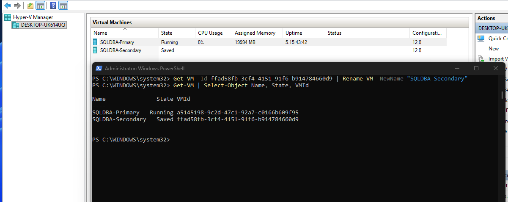

Post-clone, I had to remove a stale DVD drive reference (Hyper-V's service account couldn't access the old ISO path) and discard the VM's "Saved" state first, since hardware can't be modified while saved:

```powershell
Stop-VM -Name "SQLDBA-Secondary" -Force
Get-VMDvdDrive -VMName "SQLDBA-Secondary" | Remove-VMDvdDrive
Start-VM -Name "SQLDBA-Secondary"
```

This resolved the boot issue — the cloned VM started successfully into Windows.

**Real problem #2:** the cloned VM still had Primary's exact Windows computer name (`WIN-V614QRHKTTS`) — a genuine conflict once both machines are on the same network. My first rename attempt used `SQLDBA-SECONDARY` (17 characters), which Windows silently truncated to `SQLDBA-SECONDAR` due to the 15-character NetBIOS computer name limit. I fixed this with a shorter name:

```powershell
Rename-Computer -NewName "SQLDBA-SECNDRY" -Force
Restart-Computer -Force
```

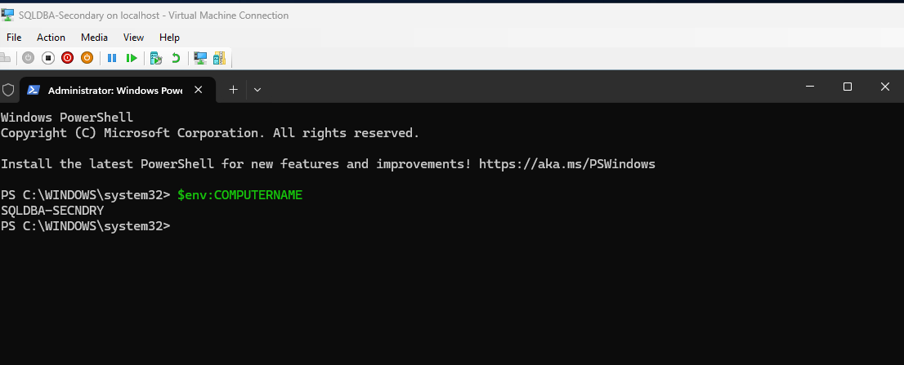

I confirmed `SERVERPROPERTY('ServerName')` automatically re-synced with the new computer name after restart — no manual SQL Server instance rename was needed, since this is a default (unnamed) instance:

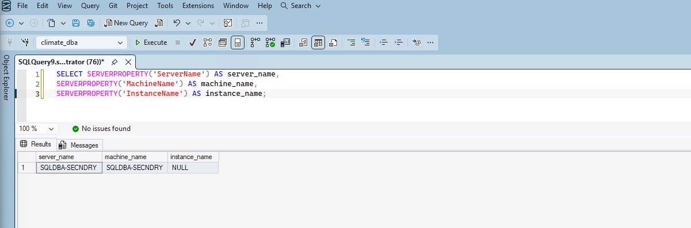

## 3. Network connectivity — a real WiFi virtual switch limitation

**Real problem #3:** ping and port tests between the two VMs' IPs (`192.168.1.213` Primary, `192.168.1.214` Secondary) both failed completely, despite opening the necessary firewall rules on both VMs.

I found the root cause via research: `SQLLab-External-Switch` is bound to a WiFi adapter, and WiFi drivers commonly block VM-to-VM traffic due to MAC address filtering — a well-documented Hyper-V limitation specific to WiFi-based external switches (wired Ethernet switches don't typically have this problem).

**Fix:** enabled MAC address spoofing on both VMs' network adapters:

```powershell
Get-VMNetworkAdapter -VMName "SQLDBA-Primary" | Set-VMNetworkAdapter -MacAddressSpoofing On
Get-VMNetworkAdapter -VMName "SQLDBA-Secondary" | Set-VMNetworkAdapter -MacAddressSpoofing On
```

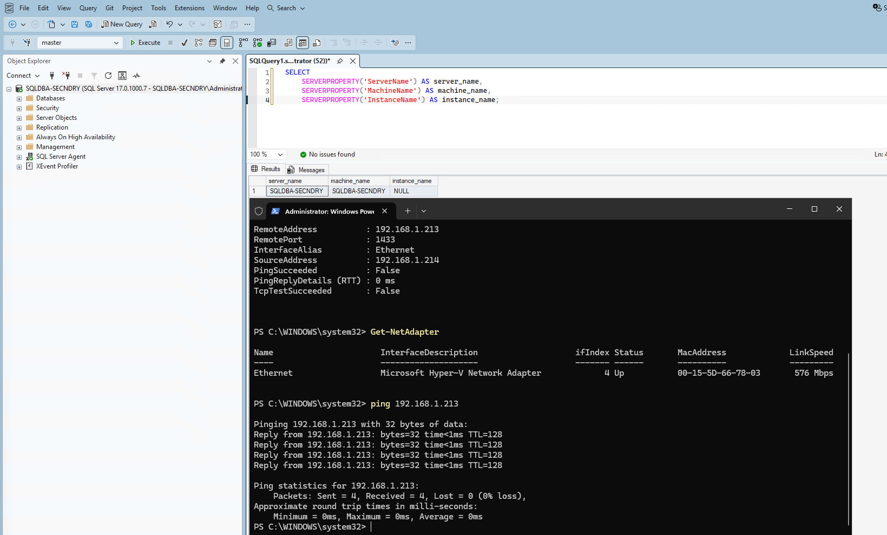

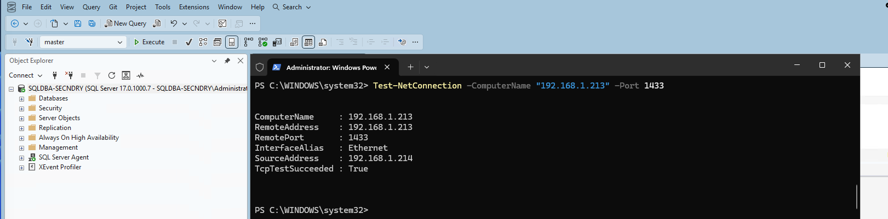

## 4. Enabled Always On on both instances

Via SQL Server Configuration Manager on both instances: **SQL Server Services → SQL Server (MSSQLSERVER) → Properties → Always On Availability Groups tab → checked "Enable Always On Availability Groups" → Apply → restarted the service.**

```sql
SELECT SERVERPROPERTY('IsHadrEnabled') AS hadr_enabled;
```

Confirmed `1` on both instances.

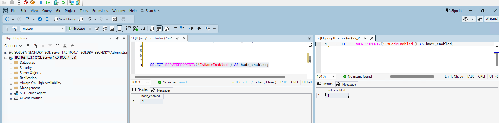

## 5. Handled the cloned database, and confirmed the TDE certificate was already present

Since `SQLDBA-Secondary` was a full clone, it had its own independent copy of `climate_dba`. A real AG secondary needs to receive its copy through the AG's own seeding process, so I dropped it:

```sql
ALTER DATABASE climate_dba SET SINGLE_USER WITH ROLLBACK IMMEDIATE;
DROP DATABASE climate_dba;
```

I also checked whether the TDE certificate (created back in Phase 6) needed to be manually restored on the secondary — since `climate_dba` is TDE-encrypted, the secondary needs this certificate to decrypt data during seeding. Because this VM is a clone, the certificate was already present, byte-identical:

```sql
SELECT name, subject FROM sys.certificates WHERE name = 'climate_dba_tde_cert';
```

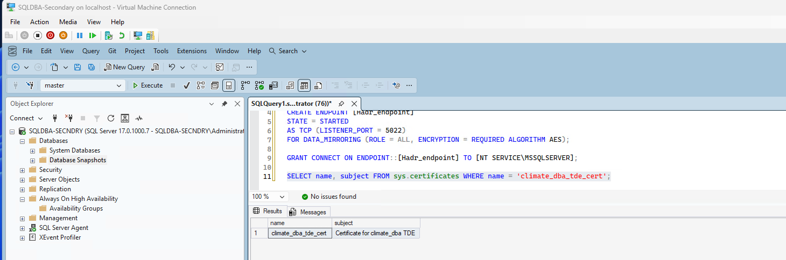

## 6. Attempted the GUI wizard — hit a real, documented SSMS limitation

I took a fresh full backup on Primary as a seed point, then opened the **New Availability Group Wizard**.

**Real problem #4:** the wizard's checkbox for selecting `climate_dba` simply would not check, no matter what I tried — direct clicks, keyboard focus plus spacebar, restarting the wizard entirely. Eventually the wizard surfaced the real reason through a dialog: **"This wizard cannot add a database containing a database encryption key to an availability group. Use the CREATE or ALTER AVAILABILITY GROUP Transact-SQL statement instead."**

This is a genuine, documented SSMS limitation — TDE-encrypted databases cannot be added to an AG through the GUI wizard at all. I switched to T-SQL entirely from this point.

## 7. Endpoint authentication — a real workgroup limitation

I created endpoints on both instances using the default Windows Authentication. Both created successfully, and I confirmed port 5022 connectivity worked in both directions:

```powershell
Test-NetConnection -ComputerName "192.168.1.213" -Port 5022  # from Secondary
Test-NetConnection -ComputerName "192.168.1.214" -Port 5022  # from Primary
```

Both returned `TcpTestSucceeded: True`.

**Real problem #5:** despite confirmed network connectivity, `ALTER AVAILABILITY GROUP ... JOIN` failed with `Msg 47106: Download configuration timeout`. The root cause: these are standalone **workgroup** machines, not domain-joined. `NT SERVICE\MSSQLSERVER` is a local virtual account on each machine with no way to authenticate to the other machine without a domain trust relationship — a genuine, well-documented limitation of workgroup-based Always On setups.

**Fix:** dropped both endpoints and rebuilt using **certificate-based authentication** instead of Windows Authentication — creating a certificate on each instance, exchanging the public certificate files between machines (via host relay, since Guest Services only works between host↔VM, not VM↔VM directly), and establishing mutual trust through logins mapped to each imported certificate.

```sql
-- On each instance: create a certificate, back up the public .cer file
CREATE CERTIFICATE [Primary_AG_Cert] WITH SUBJECT = 'Primary AG Endpoint Certificate';
BACKUP CERTIFICATE [Primary_AG_Cert] TO FILE = 'C:\ClimateData\Primary_AG_Cert.cer';

-- Recreate the endpoint using certificate authentication
CREATE ENDPOINT [Hadr_endpoint] STATE = STARTED
AS TCP (LISTENER_PORT = 5022)
FOR DATA_MIRRORING (ROLE = ALL, AUTHENTICATION = CERTIFICATE [Primary_AG_Cert], ENCRYPTION = REQUIRED ALGORITHM AES);

-- On the OTHER instance: import this certificate, mapped to a login, grant CONNECT
CREATE LOGIN [Primary_AG_Login] WITH PASSWORD = '...';
CREATE USER [Primary_AG_User] FOR LOGIN [Primary_AG_Login];
CREATE CERTIFICATE [Primary_AG_Cert] AUTHORIZATION [Primary_AG_User] FROM FILE = 'C:\ClimateData\Primary_AG_Cert.cer';
GRANT CONNECT ON ENDPOINT::[Hadr_endpoint] TO [Primary_AG_Login];
```

I repeated this in both directions (Primary trusting Secondary, Secondary trusting Primary).

## 8. Created the Availability Group

**Real problem #6:** my first `CREATE AVAILABILITY GROUP` attempt used a guessed replica name, `'SQLDBA-PRIMARY'`, which failed with `Msg 35237`. I'd confused the VM's Hyper-V display name with its actual SQL Server identity. I checked the real name directly:

```sql
SELECT SERVERPROPERTY('ServerName') AS server_name;  -- returned: WIN-V614QRHKTTS
```

With the certificate-based endpoints and correct replica name, the AG was created successfully:

```sql
CREATE AVAILABILITY GROUP [ClimateDBA-AG]
WITH (CLUSTER_TYPE = NONE)
FOR DATABASE climate_dba
REPLICA ON
    'WIN-V614QRHKTTS' WITH (ENDPOINT_URL = 'TCP://192.168.1.213:5022', AVAILABILITY_MODE = SYNCHRONOUS_COMMIT, FAILOVER_MODE = MANUAL, SEEDING_MODE = AUTOMATIC),
    'SQLDBA-SECNDRY' WITH (ENDPOINT_URL = 'TCP://192.168.1.214:5022', AVAILABILITY_MODE = SYNCHRONOUS_COMMIT, FAILOVER_MODE = MANUAL, SEEDING_MODE = AUTOMATIC);
```

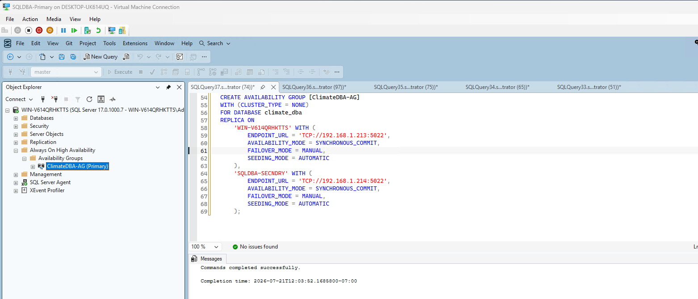

`SQLDBA-SECNDRY` joined successfully:

```sql
ALTER AVAILABILITY GROUP [ClimateDBA-AG] JOIN WITH (CLUSTER_TYPE = NONE);
ALTER AVAILABILITY GROUP [ClimateDBA-AG] GRANT CREATE ANY DATABASE;
```

`SQLDBA-SECNDRY` joined successfully — confirmed in the health check below.

## 9. Verified health and data synchronization

```sql
SELECT ag.name, ar.replica_server_name, ars.role_desc, ars.connected_state_desc, ars.synchronization_health_desc
FROM sys.availability_groups ag
JOIN sys.availability_replicas ar ON ag.group_id = ar.group_id
JOIN sys.dm_hadr_availability_replica_states ars ON ar.replica_id = ars.replica_id;
```

Both replicas showed `CONNECTED` and `HEALTHY`.

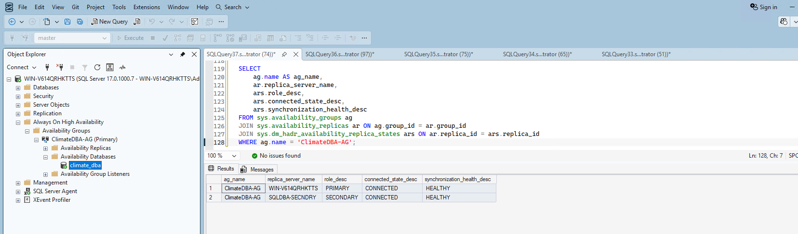

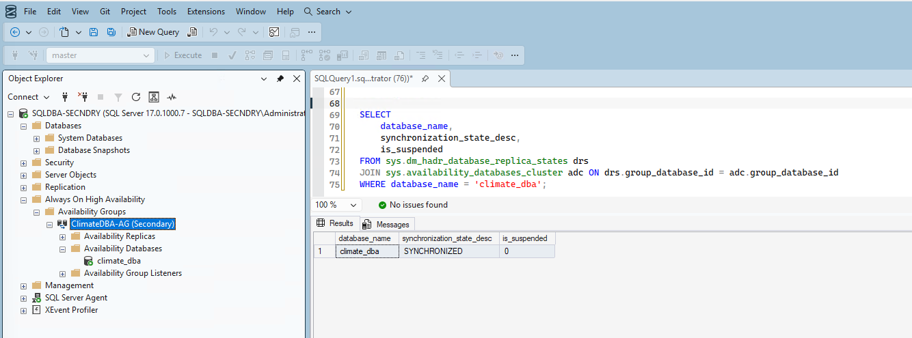

I enabled read access on the secondary and verified the actual data replicated correctly — not just that the sync status said healthy:

```sql
ALTER AVAILABILITY GROUP [ClimateDBA-AG]
MODIFY REPLICA ON 'SQLDBA-SECNDRY' WITH (SECONDARY_ROLE (ALLOW_CONNECTIONS = ALL));

SELECT COUNT(*) AS total_rows FROM climate.daily_observations;   -- 113,522,932
SELECT COUNT(*) AS total_stations FROM climate.stations;          -- 132,501
```

Both numbers matched exactly, confirming the AG's automatic seeding replicated the complete ~20GB encrypted database over the network.

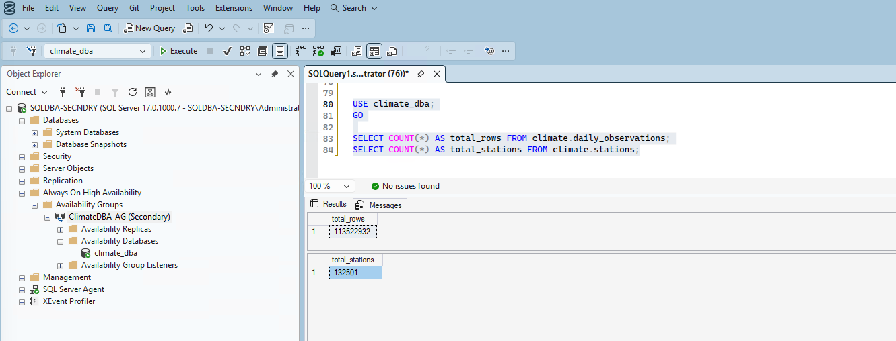

## 10. Manual failover test — and a real split-brain incident

My first failover attempt used the standard graceful failover command, which failed:

```sql
ALTER AVAILABILITY GROUP [ClimateDBA-AG] FAILOVER;
-- Msg 47122: only FORCE_FAILOVER is supported with CLUSTER_TYPE = NONE
```

This is a direct, documented consequence of not using a real WSFC — non-clustered AGs only support forced failover. I used the correct command instead:

```sql
ALTER AVAILABILITY GROUP [ClimateDBA-AG] FORCE_FAILOVER_ALLOW_DATA_LOSS;
```

This succeeded — `SQLDBA-SECNDRY` was promoted to `PRIMARY`, verified healthy, and I confirmed it was serving the complete, correct dataset (113,522,932 rows).

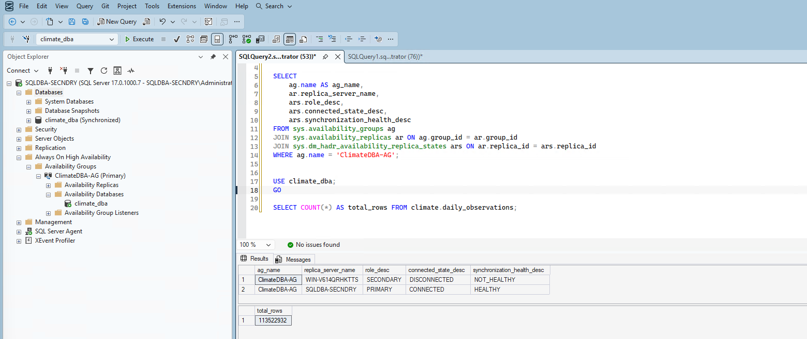

**Real problem #7 — genuine split-brain:** I then attempted to fail back to `WIN-V614QRHKTTS` to complete a round-trip test. This resulted in **both instances simultaneously believing they were the primary replica** — a real split-brain scenario. This is a well-documented, genuine risk specific to `CLUSTER_TYPE = NONE` Availability Groups: without a WSFC's quorum-based arbitration, there's no mechanism preventing two replicas from both claiming primary after a forced failover.

**Recovery:** I dropped the Availability Group entirely on both instances, verified a clean state on both sides, and rebuilt it from scratch — including resolving a leftover standalone copy of `climate_dba` on the secondary (from an earlier drop that hadn't fully cleaned up) before automatic seeding would create a fresh, properly-joined copy.

After rebuilding, I performed **one deliberate, single failover** and stopped there, rather than attempting the round-trip again:

```sql
ALTER AVAILABILITY GROUP [ClimateDBA-AG] FORCE_FAILOVER_ALLOW_DATA_LOSS;
```

Verified healthy, verified the new primary was serving the complete, correct dataset:

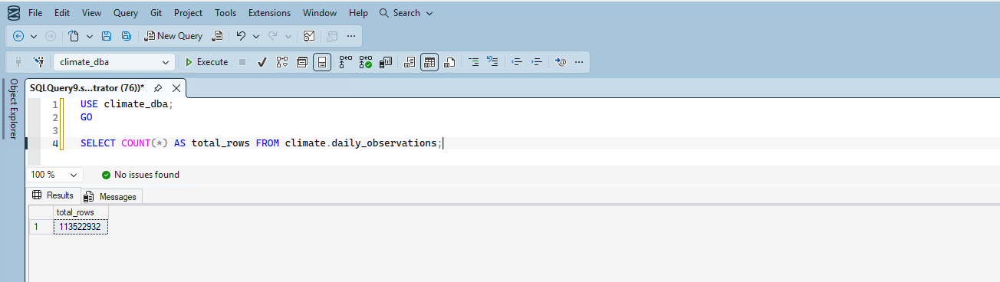

**This is exactly why production Always On deployments should use a real WSFC with Active Directory** — it exists specifically to prevent the split-brain scenario I hit, through proper quorum arbitration.

## Summary

| Item | Status | Real issue encountered |
|---|---|---|
| Secondary VM provisioning | ✅ Complete (via clone) | ISO boot failure — documented Hyper-V/Windows Server 2025 issue |
| Computer rename | ✅ Complete | Hit the 15-character NetBIOS limit |
| Network connectivity | ✅ Complete | WiFi virtual switch MAC filtering |
| Always On enabled | ✅ Complete | None |
| Endpoint authentication | ✅ Complete | Workgroup auth limitation — required certificate-based endpoints |
| Availability Group created | ✅ Complete | Guessed replica name was wrong (VM display name ≠ SQL Server name) |
| Data synchronization | ✅ Verified | None — clean, matching row counts |
| Manual failover | ✅ Verified (single direction) | Graceful failover unsupported without WSFC; round-trip attempt caused genuine split-brain, requiring a full AG rebuild |

## What's Next

With a genuinely working (if hard-won) Always On Availability Group in place, Phase 10 moves into monitoring — DMV-based queries and Extended Events for ongoing observability.
